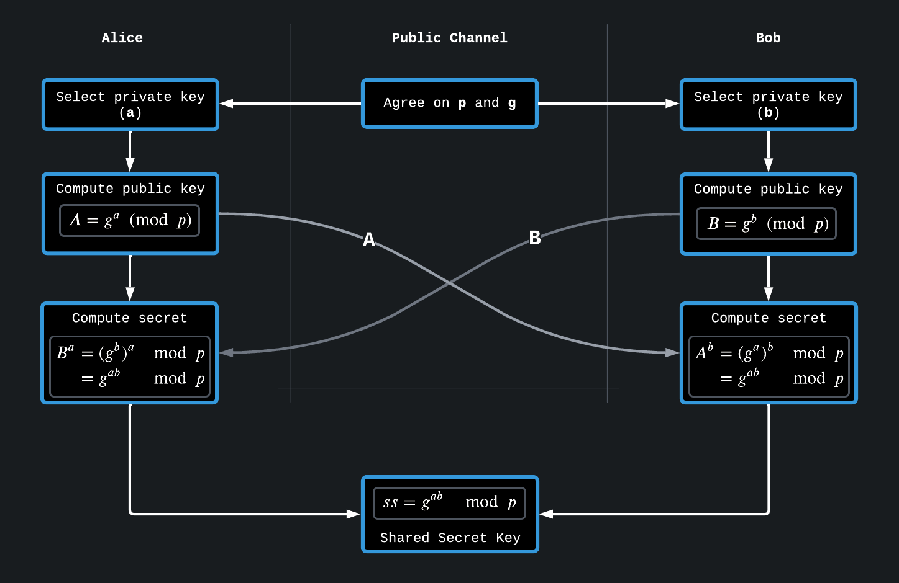

# Diffie-Hellman

## Description

Symmetric encryption like AES requires a **Shared Secret** from both parties to be able to communicate securely across a **Public Channel** where messages can be intercepted or altered. Asymmetric on the other hand just requires both parties to have their own keypair, but it is very slow to compute in comparison to symmetric encryption. \
The **Diffie-Hellman Key Exchange** solves this problem by utilizing an asymmetric scheme to create a shared secret that can then be used for symmetric encryption.&#x20;

<figure><figcaption><p>Diffie-Hellman Key Exchage<strong>:</strong> Shared Secret is computed by Alice and Bob with a Public Channel</p></figcaption></figure>

Performing this algorithm is pretty simple. A _prime_ number `p` and _generator_ `g` are chosen (often some well-known numbers), and Alice and Bob both have their own _private key_. Using the public `g` and `p`, they both compute their _public key_, which is shared across the Public Channel. When the other receives their public key, they use their private key to compute the final secret.

The order in multiplication does not matter, meaning Alice's $$g^{a*b}$$ will be the same as Bob's $$g^{b*a}$$.\
All without ever showing the private `a`, `b`, or the secret.&#x20;

In summary, Alice's private key + Bob's public key == Bob's private key + Alice's public key.

### Security

The difficulty comes from knowing $$A = g^a \mod p$$, but being unable to compute `a` from it. It is known as the [Discrete Logarithm Problem](https://en.wikipedia.org/wiki/Discrete\_logarithm) and if an efficient algorithm is ever found, it would break a lot of cryptography.&#x20;

$$
\begin{split}
output &= base^{exponent} \mod p \\
{ }\\
{exponent} &= log_{base}(output) \mod p
\end{split}
$$

Read this [Wikipedia section ](https://en.wikipedia.org/wiki/Diffie%E2%80%93Hellman\_key\_exchange#Security)about security for some more information, and a fun practical attack against the internet as we know it.

## Attacks

There are many different attacks for the Diffie-Hellman key exchange, especially if you have some control over the numbers that computations happen on. I recommend looking up \
"diffie hellman ctf" in your favorite search engine to find some practical examples.&#x20;

An important piece here is the group order $$G$$ of the modulus `p`, which is normally `p-1`. But if this `p-1` value can be **factored into small primes**, this greatly reduces the strength and makes it vulnerable to Pohlig–Hellman algorithm (see [#g-only-has-small-factors](diffie-hellman.md#g-only-has-small-factors "mention")). If it helps, read [this answer](https://crypto.stackexchange.com/questions/87137/how-to-get-the-order-of-a-group-generator-in-dh/87138#87138) to understand how $$G$$ is calculated in Diffie-Hellman.

After breaking the logic and finding a private key, you can often just calculate the shared secret yourself and use it to decrypt whatever messages were encrypted.

### Computing manually

A simple approach to solving the Discrete Logarithm using a **meet-in-the-middle** algorithm. It tries to compute private key `a` from a known public key `A`, `g` and `p`. A requirement for this algorithm is that the group order $$G$$ explained above is **small**.&#x20;

[`sage`](https://github.com/sagemath) is a useful tool in mathematics that has many features and built-in algorithms. One of which is the [`discrete_log`](https://doc.sagemath.org/html/en/reference/groups/sage/groups/generic.html#sage.groups.generic.discrete\_log) function that has several common algorithms implemented that it will choose from automatically. When dealing with Diffie-Hellman and non-standard generation of `p`, it's a good idea to try throwing it into this function to find out if it is easily breakable:

```renpy
R = IntegerModRing(p)  # Handle modular arithmetic
a = discrete_log(R(A), R(g))  # Compute a (Alice) from A and g mod p
b = discrete_log(R(B), R(g))  # Compute b (Bob)   from B and g mod p
```

### G only has small factors

Normally, the group order $$G$$ has a large prime factor keeping it safe, but if this is not the case (eg. created from many small primes), [Pohlig–Hellman algorithm](https://en.wikipedia.org/wiki/Pohlig%E2%80%93Hellman\_algorithm) can be used to efficiently perform the Discrete Logarithm. The `discrete_log()` function from sage will also try this method **automatically** if it finds the group order is composite instead of prime, so the same method as above can be used.

For a simple explanation of the idea behind this attack, [read this example](https://github.com/zelinsky/CTF-Course/blob/master/Classes/16.md#example).
