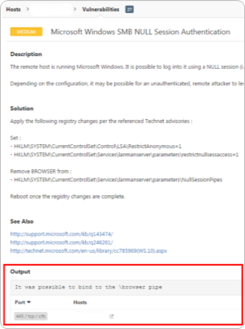

# NASL (Nessus Plugins)


I had the misfortune of wanting to build a plugin for Nessus. This turned out to be way more difficult than expected for many reasons. There is **no official documentation** and only a handful of short blog posts. You **learn** this proprietary language by **looking at examples**. That is why I wanted to document what I have learned on this page.

Know what you're in for when wanting to write NASL. If you are still confident, read on.


## Getting Started

[Nessus by Tenable](https://www.tenable.com/products/nessus) is a community and professional application that automatically performs some known attacks. It is mostly focused on CVEs with its many plugin implementations that test for these. It is possible to write your own custom plugins in a proprietary language called NASL (Nessus Attack Scripting Language).

These plugins execute when you start a scan and select them. For each host, each time a configured port for the script is found, the script will be executed and can run checks to eventually make a vulnerability report.

Nessus can report one vulnerability per one plugin.

### Setup

It is useful to create a simple testing setup locally while developing plugins, before deploying it in the real world. Using [Docker](https://www.docker.com/), you can create a reproducible and isolated environment where Nessus can run. The following compose file defines a basic Nessus container:


```yaml
services:
  nessus:
    image: tenable/nessus:latest-ubuntu
    ports:
      - 8834:8834
    volumes:
      - nessus:/opt/nessus

volumes:
  nessus:
```


Save the above file somewhere, and run:

```sh
docker compose up --build
```

After a few moments, the application should become available on [https://localhost:8834/](https://localhost:8834/) and finish initializing. You should click through the setup this one time and choose _Register for Nessus Essentials_ for a free community version. This configuration will be saved in the Docker `nessus` volume the next time you start it.

If you don't have an activation code yet, create one by following the instructions. Then, create an admin account and save the password you input. The _Downloading plugins..._ step will take a long time, after which it will also have to compile all plugins in the background, taking even longer. Have some patience because this only has to be done once.

When everything is completed (tasks in [/#/settings/notifications](https://localhost:8834/#/settings/notifications) are finished, your terminal should give a progress bar), we can start to customize the setup. When we eventually add our own plugins, the loading process will have to recompile all other plugins as well. It takes way too much time to iterate on an idea, but we can remove some unnecessary plugins for testing.

#### Removing Standard Plugins

In this step, we will only keep the `.nasl` files that are referenced by the standard libraries. At any point, you can add more necessary files from `plugins.bak/` back into `plugins/`.

1. Get a shell in your container:

```bash
docker compose exec -it nessus bash
```

2. Move all plugins to a backup directory:

```bash
cd /opt/nessus/lib/nessus/
mkdir -p plugins.bak
find plugins/ -mindepth 1 -exec mv -t plugins.bak/ {} +
```

3. Copy all non-`.nasl` files (and optionally your plugin already if you have one):

```bash
cd plugins.bak/
cp $(find -type f ! -name "*.nasl") ../plugins/
cp /tmp/your_plugins ../plugins/
```

4. Recursively copy dependencies:

```sh
for i in {1..20}; do
    cp $(egrep -hor "[A-Za-z0-9_-]+\.nasl" ../plugins/ | sort -u) ../plugins/ 2>/dev/null
done
```

#### Settings & Reloading

One important setting that allows unsigned plugins (that we write) to run is the following:

```bash
/opt/nessus/sbin/nessuscli fix --set nasl_no_signature_check=yes
```

Finally, we can reload the plugins as we set up above with the following commands:

```bash
/opt/nessus/sbin/nessusd -R    # Recompile plugins
supervisorctl restart nessusd  # Restart Nessus (only needed for settings change)
```

### Development Cycle

Eventually, you will write `.nasl` files, make slight edits, and want to reload them. To do this, I recommend keeping your plugin in a separate folder nested inside the `plugins` folder because they are loaded recursively. You can then replace the entire folder and trigger a plugin reload, which will be much faster after removing the standard plugins.

```sh
docker compose exec nessus rm -rf /opt/nessus/lib/nessus/plugins/your_plugins
docker compose cp your_plugins nessus:/opt/nessus/lib/nessus/plugins/
docker compose exec nessus /opt/nessus/sbin/nessusd -R
```

You can start a test scan with your plugin by pressing _New Scan_ in the UI, and then selecting _Advanced Scan_ to configure which plugins will be used. On the _Plugins_ tab, you can unselect every plugin except your category.

Give the plugin a name, and for testing, you can target `host.docker.internal` to point to your local machine. By going to _Discovery_ and _Port Scanning_, you can also restrict the ports (_Port scan range_) to only the port you are testing on, to prevent long or unintentional scans.

When pressing _Launch_, this should hit your testing server with some enumeration requests, and the custom plugin will run if it matches the port/service.


**Tip**: If your custom plugin did not launch, you may have a non-default port and use a service like `Services/www` name inside your script. Service detection must be on for these kinds of names, otherwise, your script won't be triggered.

Go to the _Plugins_ tab and enable the _Service detection_ category.


## Plugins

This section explains what is needed to write a plugin, and some tips to enhance the experience.

### Plugin Attributes

All scripts have to start with a `description` part, where it runs some code while reloading the plugins to set its title, description and other attributes. Below is a minimal example:

<pre class="language-ruby"><code class="lang-ruby">include('compat.inc');

<strong>if (description) {
</strong><strong>  script_id(910000);  # Must be unique across all plugins
</strong><strong>  script_version('0.1');
</strong><strong>
</strong><strong>  script_name(english:'Testing');  # Title
</strong><strong>  
</strong><strong>  # script_set_attribute(...
</strong><strong>  
</strong><strong>  script_category(ACT_GATHER_INFO);
</strong><strong>  script_copyright(english:'This script is Copyright (C) 2024 by Company');
</strong><strong>  script_family(english:'!Testing');  # Categories are automatically created
</strong><strong>
</strong><strong>  script_dependencies('logins.nasl', "find_service1.nasl", "http_version.nasl");
</strong><strong>  script_require_ports("Services/www", 80);  # Trigger script when port is discovered
</strong><strong>  exit(0);
</strong><strong>}
</strong>
# Regular script code
display('Hello, world!');
</code></pre>

All plugins require a **unique** `script_id()` value, otherwise they won't show up. Keep in mind that many IDs are already taken by standard plugins, so take a really high number (eg. 900000+) to make sure it is outside of this range.

Some more attributes can optionally be added to enhance the documentation of your plugin:

```ruby
script_set_attribute(attribute:'synopsis', value:'Short summary of plugin');
script_set_attribute(attribute:'description', value:'Larger description\nwith multiple\nlines');
script_set_attribute(attribute:'see_also', value:'https://example.com/1');
script_set_attribute(attribute:'see_also', value:'https://example.com/2');
script_set_attribute(attribute:'solution', value:'Another large explanation\nof how to solve this issue');
script_set_attribute(attribute:'plugin_type', value:'remote');
script_set_attribute(attribute:'risk_factor', value:'high');
script_end_attributes();

script_timeout(259200);  # 3 days in seconds. Just '0' seems to default to an hour
```

### Syntax

NASL looks a lot like other programming languages like JavaScript, with if-statements and while-loops being practically identical.&#x20;


```ruby
if (variable == 1337) {
    ...
} else if (variable < 42 && variable > -42) {
    ...
} else {
    ...
}
```



```ruby
while (!success) {
    sleep(1);
    success = func();
}
```


For-loops are the same as in C-like languages, but another `foreach` statements exists to ease looping over elements in a list:


```ruby
for (var i = 0; i < 10; i++) {
    ...
}
```



```javascript
foreach var port (ports) {
    display(port);
}

foreach (var port in ports) {
    display(port);
}
```


Assigning variables without a prefix will make them _global by default_. If you instead use `var` in front of a variable, it will be scoped locally.&#x20;


Keep this in mind when naming function variables, as it may be easy to accidentally overwrite another global variable with the same name while executing your function!



```javascript
function func() {
    global = 1337;
    var local = 42;
}
```


Values of variables may be _integers, strings, booleans, arrays, dictionaries, and_ more. You can define each one as follows:


```javascript
var integer = 1337;
var string = "Hello, world!";
var boolean = TRUE;
var array = [1, "2", [3]];
var dictionary = {"key": value, "another": [1, 2, 3]};
```


You can index arrays and dictionaries with square brackets (`[]`):


```javascript
var three = array[2][0];
var value = dictionary["key"];
```


Strings can be added together to form complex messages. Adding integers to strings automatically converts them. Note that the `display()` function doesn't automatically add newlines, which you may want after each message. You can write this special character using the `\n` escape, but only inside single-quoted (`'`) strings, not in double-quoted (`"`) strings:


```javascript
display("Var: " + "test" + ", " + 1337, '\n');
// Var: test, 1337
```


Function calls as seen above can have _unnamed parameters_ separated by commas (`,`). Many other functions also use _named parameters_ which have a `key: value` format:


```javascript
display("Hello, world!");
http_send_recv3(method:"GET", item:"/", port:port);
```


To define your own function that accepts parameters, use the `function` keyword. Names between the paratheses are _named parameters_, and _unnamed parameters_ can be accessed via the special `_FCT_ANON_ARGS` variable. All parameters are optional and will be null if they are not given a value by the caller. You must define/include functions before they are called.


```javascript
function log(name, another) {
  var msg = _FCT_ANON_ARGS[0];
}

log("msg", another:1337);
// msg = "msg", name = null, another = 1337
```


### Understanding Functions

There is no official documentation about functions available in NASL. There are some built-in functions and ones you can import via `include("...")` statements. The best way to understand functions is by looking at examples, and by looking at its source code definition.&#x20;

We will have to search through all plugins quickly, for which [`ripgrep`](https://github.com/BurntSushi/ripgrep) is a great tool:


```bash
apt update && apt install ripgrep
```


If we want to understand the `http_send_recv3` function, for example, we can search for it recursively with the following command to see its usages:

<pre class="language-shell-session" data-overflow="wrap"><code class="lang-shell-session">$ cd /opt/nessus/lib/nessus/plugins.bak
<strong>$ rg -F 'http_send_recv3('
</strong>
hp_sim_wmi_mapper_unauth_access.nasl
90:      res = http_send_recv3(method:"GET", item:"/", port:port);

pligg_detect.nasl
70:  res = http_send_recv3(method: "GET", item: url, port: port, exit_on_fail: TRUE);

phpmywebhosting_sql_injection.nasl
79:  r = http_send_recv3(method: "POST", item: strcat(dir, "/index.php"), port: port, add_headers: make_array("Content-Type", "application/x-www-form-urlencoded"), data: variables, exit_on_fail: TRUE);
</code></pre>

For a more complete overview of a command's options and where to `include`it from, we can look for its definition:

<pre class="language-shell-session" data-overflow="wrap"><code class="lang-shell-session"><strong>$ rg -F 'function http_send_recv3('
</strong>
http_network.static
1084:function http_send_recv3(target, port, host, method, item, data, version, add_headers, username, password, fetch404, only_content, no_body, follow_redirect, content_type, exit_on_fail, transport, client_cert, client_private_key, client_private_key_password, unrestricted_redirect)
</code></pre>

We find many possible options, which you may also search for to find examples. We shouldn't include this `.static` file directly in our `.nasl` script, but instead, look for a `.inc` file:

<pre class="language-shell-session"><code class="lang-shell-session"><strong>$ rg -F 'http_network.static'
</strong>
http.inc
29:include("http_network.static");
</code></pre>

It appears that `http.inc` includes the file and thus the function, together with some additional HTTP utilities. Therefore, you should include `http.inc` in your code if you intend to use the function.

#### Function Definitions

We saw a function definition above of `http_send_recv3()` with many different parameters. These in are all _named parameters_ and can be filled in a function call by specifying their name followed by a value, like `name: value`.

Some functions also have _unnamed parameters_, these are less obvious and don't show on the same line as the function name. Instead, in the function body it can reference `_FCT_ANON_ARGS` with an index to find the nth unnamed parameter. You can call only these functions with `func(arg1, arg2)` syntax. You can search the name and look for the first few lines:

<pre class="language-shell-session"><code class="lang-shell-session"><strong>$ rg -F -A 5 'function json_write('
</strong>
json2.inc
853:function json_write()
854-{
855-  local_var ds, type;
856-
<strong>857-  ds = _FCT_ANON_ARGS[0];
</strong>858-  type = typeof(ds);
</code></pre>

#### Useful Functions

Below are some more useful functions to get started:

* `append_element(var, value)`: Append an element (`value`) to a list (`var`)
* `isnull()`: Check if the first argument is `null`
* `split(sep, keep)`: Split the string in the first argument by `sep` into an array. `keep` decides to keep the separator in the array as an extra element between each split element
* `tolower()`: Lowercase the first argument
* `int()`: Parse a string as an integer
* `json_read()`: Read the first argument as JSON, returning a parsed object that you can index

### Debugging

There is no Visual Studio Code language support for NASL. One language that comes close to its syntax is Ruby, which you should [select ](https://code.visualstudio.com/docs/languages/overview#_change-the-language-for-the-selected-file)for the `.nasl` extension.

At `/opt/nessus/bin/nasl`, there exists a binary that can be used to test a `.nasl` script. It will run the code and give you output in the terminal. Note that it won't have access to ports or hosts and is only meant for testing. It is, however, a very useful tool in testing syntax and logic in NASL, without having to go through the whole recompilation hassle for every code change.

For debugging, the `display()` function can simply show output in the console. When using the `nasl` binary, the first argument is printed to your terminal. When running installed in Nessus, the output can be found inside `/opt/nessus/var/nessus/logs/nessusd.dump`, where all debug logging is written.

Similarly, `json_write()` is useful for viewing objects in a JSON structure. It may look like this:

```ruby
display('Some variable = ' + variable, '\n');
display('JSON-formatted = ' + json_write(obj), '\n');
```

### Output

The `security_report_v4()` function should be used to report vulnerabilities back to Nessus. These will then be displayed in the UI. Below is an example report:

```ruby
port = get_http_port(default:80);
...
report = 'Dynamic details about this vulnerability:\n' + var + '\n'
security_report_v4(port:port, severity:"high", extra:report)
```

The text in the `extra:` parameter is the only way to send dynamic text to the UI. Other information is already statically defined in [#plugin-attributes](nasl-nessus-plugins.md#plugin-attributes "mention").

Nessus decides its severity by the `'risk_factor'` attribute and `severity:` function parameter. Below is a matrix showing how the final value is calculated:

<table><thead><tr><th width="212">Nessus Setting</th><th width="105">none</th><th width="102">low</th><th width="103">medium</th><th width="104">high</th><th>critical</th></tr></thead><tbody><tr><td><code>SECURITY_NOTE</code></td><td><mark style="color:blue;"><strong>INFO</strong></mark></td><td><mark style="color:yellow;"><strong>LOW</strong></mark></td><td><mark style="color:yellow;"><strong>LOW</strong></mark></td><td><mark style="color:yellow;"><strong>LOW</strong></mark></td><td><mark style="color:yellow;"><strong>LOW</strong></mark></td></tr><tr><td><code>SECURITY_WARNING</code></td><td><mark style="color:orange;"><strong>MEDIUM</strong></mark></td><td><mark style="color:orange;"><strong>MEDIUM</strong></mark></td><td><mark style="color:orange;"><strong>MEDIUM</strong></mark></td><td><mark style="color:orange;"><strong>MEDIUM</strong></mark></td><td><mark style="color:orange;"><strong>MEDIUM</strong></mark></td></tr><tr><td><code>SECURITY_HOLE</code></td><td><mark style="color:red;"><strong>HIGH</strong></mark></td><td><mark style="color:red;"><strong>HIGH</strong></mark></td><td><mark style="color:red;"><strong>HIGH</strong></mark></td><td><mark style="color:red;"><strong>HIGH</strong></mark></td><td><mark style="color:purple;"><strong>CRITICAL</strong></mark></td></tr></tbody></table>

<figure><figcaption><p>Reference image showing different possible severities</p></figcaption></figure>

Clicking on a vulnerability looks something like this, where the _<mark style="color:red;">red</mark>_ part is the dynamic output (the `extra:` parameter). All the rest are decided by static attributes.

<figure><figcaption><p>Example of a plugin output with <em>Output</em> highlighted</p></figcaption></figure>

### Multiple Plugins

As seen in the last image, only the _Output_ section of a vulnerability report is dynamic. All other information must be decided beforehand while compiling the plugin in the `if (description)` section. There are cases where your idea may find multiple different vulnerabilities that should all get a unique title.

While it is simply impossible to alter the title at runtime, you can create multiple plugins that communicate with each other. You will have to write out every possible title and make a unique plugin for it (ideally using a template), which can then communicate to work together.

Plugins are sandboxes, and the only real way for plugins to **communicate** is through the _Knowledge Base_ (KB). This is a store of keys and values that can be read and written to by any plugin, and will be globally shared. Some existing plugins use this to store which ports are open, which services are detected, or what should be skipped.

One important fact is that the order of plugins is not guaranteed, any plugin may run before another plugin. Plugins run in parallel (5 at a time by default) for maximum efficiency. This can make it difficult to manage a group of plugins as you cannot assign a "main" plugin beforehand. Remember, it may happen that your chosen "main" plugin is 6th in the queue, while 5 other plugins in your group are waiting on the main plugin, creating a **deadlock**.

To solve this, any plugin must be able to become the main plugin of your group. Using the Knowledge Base on a unique key, your plugins can collectively decide on a main plugin by their unique script ID. We also need to be careful of race conditions as multiple plugins will be accessing the KB in parallel. The following code snippet handles this:

<pre class="language-ruby" data-title="Main script election algorithm" data-overflow="wrap"><code class="lang-ruby">id = 900000 + 1;  # Many plugins with unique IDs and the same code
if (description) {
  script_id(id);
  ...
}

<strong>prev_main = get_kb_item("my_group/main");
</strong><strong>if (!prev_main) { # Try to not set it if it is already set
</strong><strong>  set_kb_item(name:"burp/main", value:id);
</strong><strong>}
</strong><strong>sleep(1); # Wait while parallel scripts may be overwriting each other
</strong><strong>main = get_kb_item("my_group/main"); # Last set script will win
</strong><strong>is_main = (main == id);
</strong>
if (is_main) {
  display(id + ": I am the main script", '\n');

  # Share a value with follower scripts
  shared = some_random_value();
  set_kb_item(name:"my_group/shared", value:scan_id);
} else {
  display(id + ": I am a follower script", '\n');
  
  # Receive value from main script
  shared = get_kb_item("burp/shared");
  while (!shared) {
    display(id + ": Waiting for main script...", '\n');
    sleep(1);
    shared = get_kb_item("burp/shared");
  }
}
# At this point, one script will be the "main" script, and all scripts have received the same value `shared` from the main script.
</code></pre>

## Resources

Below are a few small online resources that were useful while learning about NASL:

* [https://avleonov.com/2018/11/05/adding-custom-nasl-plugins-to-tenable-nessus/](https://avleonov.com/2018/11/05/adding-custom-nasl-plugins-to-tenable-nessus/)
* [https://github.com/tenable/nasl](https://github.com/tenable/nasl)
* [https://github.com/greenbone/openvas-scanner/blob/main/doc/manual/nasl/built-in-functions/description-functions/script\_family.md](https://github.com/greenbone/openvas-scanner/blob/main/doc/manual/nasl/built-in-functions/description-functions/script_family.md)
* [https://github.com/schubergphilis/custom-nessus-plugins](https://github.com/schubergphilis/custom-nessus-plugins)
* [http://www.vijaymukhi.com/seccourse/nasl.htm](http://www.vijaymukhi.com/seccourse/nasl.htm)
* [https://litux.nl/mirror/networksecuritytools/0596007949/networkst-CHP-1-SECT-12.html](https://litux.nl/mirror/networksecuritytools/0596007949/networkst-CHP-1-SECT-12.html)
* [https://kaimi.io/en/2019/04/writing-simple-nessus-plugin-en/](https://kaimi.io/en/2019/04/writing-simple-nessus-plugin-en/)
* `/opt/nessus/lib/nessus/plugins`
