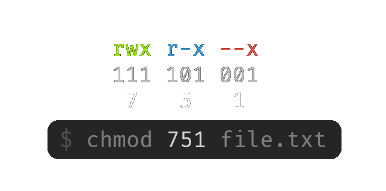

# Filesystem Permissions

## Regular Permissions

When running the `ls` command to see files in a directory, you can provide the `-l` flag to list all information about the file as well. Together with `-a` to see all files (including ones starting with a `.` dot), you get a common command to see file permissions and other information:

<figure><figcaption><p>Using the <code>ls</code> command to see file permissions</p></figcaption></figure>

Here there are different columns with different purposes. The first column shows the permissions for the file or directory, depending on how much you are related to the item. This is about the owner and group of the file. To the right of the permissions, there are 2 names, the **user** and the **group** owner. Different permissions apply to the owner or group of the file than other users on the system.&#x20;

The first yellow letter in the permissions shows the **type**, either `d` for a directory or `-` for a regular file. Then there are 3 pairs of 3 letters.&#x20;

`r` = **r**ead\
`w` = **w**rite\
`x` = e**x**ecute

The first <mark style="color:green;">green</mark> pair shows the **user** permissions. The second <mark style="color:blue;">blue</mark> pair shows the **group** permissions, and finally, the last <mark style="color:red;">red</mark> pair shows **everyone else**'s permissions, that aren't the user or group owner.&#x20;

This allows separate permissions for the owner, group, and everyone else. A `-` dash means the permission that should be in that spot is not given. You could for example make a file readable, but not writable or executable with a `r--` permission.&#x20;


**Note**: For _directories_, these `rwx` permissions mean something slightly different:

`r` = **r**ead -> list files inside\
`w` = **w**rite -> create files inside\
`x` = e**x**ecute -> travel inside with `cd`


Something not yet covered is the `s` permission that you might see instead of `x`. This is a special permission meaning **s**etuid. When this bit is set, and you can execute it, you will gain the rights of the program **owner** while executing the program. This means if the program has any functionality to read files, for example, you can read files with the rights of the program owner.&#x20;

This sounds dangerous because it is. Only very few programs actually require this, like `sudo` for example to give you higher permissions only if you put in the correct password first. For more information on this see [#setuid](command-triggers.md#setuid "mention").

## Chmod

`chmod` is short for "**ch**ange file **mod**e bits", as these permissions are also known as mode bits. This tool allows you to **change** the permissions of a file. The syntax to do so might take some getting used to, but it works as follows.&#x20;

You take the permissions for the 3 pairs and convert them to a binary number representing which permissions you want to give, and the ones you don't. Then convert this binary number to decimal, and you get a string of 3 numbers as follows:



This command above would mean the files is readable, writable, and executable by the owner, not writable by the group, and for everyone is it only executable. There are some more common file permissions you might want to set, for example:

* `600` (`rw- rw- ---`): Only readable or writable by owners of the file
* `777` (`rwx rwx rwx`): Everyone can do anything with the file

### Different syntax

Some more useful syntax you might see is using the `+` symbol in the mode bits, followed by a permission. This is some short syntax to **add** the permission to the bits if it wasn't already there. Without further specification, it will apply the permission to all 3 pairs.&#x20;

<pre class="language-shell-session"><code class="lang-shell-session">rw- rw- r--
<strong>$ chmod +x file  # Add executable permission for everyone
</strong>rwx rwx r-x
$ chmod +s file  # Add setuid permission to user and group owner
rws rws r-x
</code></pre>

You can also specify with the user (`u`), group (`g`) or other users (`o`) what permissions you need exactly without having to think about the binary numbers. Simply prefix one of these letters before the permission to only apply it there.&#x20;

<pre class="language-shell-session"><code class="lang-shell-session">rw- rw- r--
<strong>$ chmod u+x file  # Add executable permission for the user owner
</strong>rwx rw- r--
<strong>$ chmod o+rwx file  # Add all permissions for other users
</strong>rwx rw- rwx
</code></pre>

## Access Control List (ACL)

Sometimes you might see a `+` plus symbol after the permissions of a file/directory in `ls -l`. This means it has additional, more specific permissions that might be abusable. To view these permissions, use the `getfacl` command:

<pre class="language-shell-session"><code class="lang-shell-session"><strong>$ getfacl -t file.txt
</strong>USER   root      rwx
user   john      rw-
GROUP  root      rwx
mask             rwx
other            r--
</code></pre>

Here the `-t` argument gives a simpler layout of the results. You can see the USER, GROUP, and other permissions that `ls -l` already gives, as well as the additional permission: `user john rw-`. This is interesting because it means the user `john`, who is not the owner of the file, still has write permissions, while other users can only read.&#x20;

You can find all files with extra ACL permissions with the following recursive command:

```shell-session
$ getfacl -R -s -t / 2>/dev/null
```

In a default system, these permissions are rarely used, so any results may be worth checking out.&#x20;

### Hidden Permissions

In specific scenarios, you might find some automated functionality that tries to check if some file or directory is protected enough that you should not have write access. It can do so by checking if you aren't the user or group owner, and if the `w` bit is not set for other users. It might think this is enough, but using ACLs you can create extra specific permissions that go further than just bits, possibly fooling the check.&#x20;

Setting permissions is done using the `setfacl` command. Here are some of the important **flags**:

* `-m`: Modify (overwrite) permissions
* `-x`: Remove permissions
* `-b`: Remove all ACL entries
* `-d`: Set default ACLs

After the flag comes the **entry itself**. The format is `[type]:[uid/gid]:[perms]`:

* User: `u:hacker:rwx`
* Group: `u:hackergroup:rwx`

If we wanted to create a _backdoor_ of sorts where it looks like we shouldn't have permissions, but due to ACLs we can still write, we can add our user with `rwx` rights:

<pre class="language-shell-session"><code class="lang-shell-session"><strong>$ sudo setfacl -m u:hacker:rwx dir/
</strong>$ ls -l
drwxrwx<a data-footnote-ref href="#user-content-fn-1">r-x+</a> 2 root root 4096 Jul  8 09:03 dir
</code></pre>

## Capabilities

A different way administrators can give **more privileges to a binary** is through _capabilities_. Especially the `cap_setuid` is very interesting because similar to the [#setuid](command-triggers.md#setuid "mention") bit, it executes a program as another user.&#x20;

### Finding capabilities

To get all your capabilities as a user, use the `getcap` command. It will give a lot of errors, so just redirect them to `null` to get a clean output. Note that this command can take a bit because it looks through the whole system. &#x20;

```shell
getcap -r / 2>/dev/null
```

To only get `setuid` capabilities you can filter it with `grep`:

```bash
getcap -r / 2>/dev/null | grep cap_setuid
```

### Exploiting capabilities

After finding binaries with special capabilities, you can look them up on [GTFOBins](https://gtfobins.github.io/#+capabilities) to see if any functionality is exploitable:


GTFOBins, a searchable list of exploitable binaries


Then just use a command you find there to get higher privileges. Since the `cap_setuid` capability is the same as the [#setuid](command-triggers.md#setuid "mention") bit on a file, you can use the same exploitation ideas from there.&#x20;

Another capability you might find is `cap_net_raw,cap_net_admin=eip` on `tcpdump` specifically. This is so that it can use the raw packet intercepting it needs, but can also allow anyone on the system to use it without needing `root` permissions. While this might be the intended behavior, an attacker can exploit this by intercepting traffic containing passwords or other sensitive information.&#x20;

[^1]: `w` is not set, but a `+` shows ACL perms
