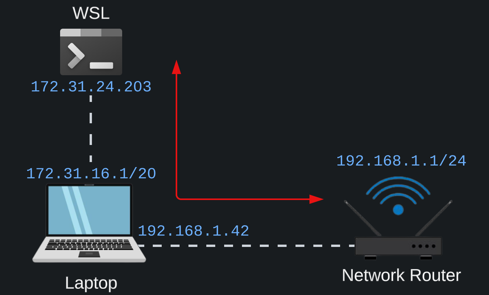

# WSL Tips

Windows is still an incredibly popular Operating System. While some leet hackers switch over to Linux for various reasons, most beginners and some stubborn people like me stay on Windows. But very often you'll want to use some Linux tools that others have built.&#x20;

This is where Windows Subsystem Linux (WSL) becomes really handy. While you could make a Virtual Machine to have a Linux environment, I find that your main OS and the VM won't work together much. Often you're completely in the VM or completely outside of it, and have to adapt to the new environment.&#x20;

With WSL the only thing you get is the Linux command line, which is often the one thing you want from Linux. The command line is just far superior to PowerShell or CMD. So WSL allows you to keep the GUI and feeling of Windows you're used to while gaining the advantages of a Linux command line as if it were your regular terminal.&#x20;


**Note**: If you're worried about GUI tools in WSL, they even have you covered on that front. Starting Linux GUI tools installed from the command line will simply work, and will pop up a window on Windows with the Linux look. The only thing you miss with WSL is the Desktop environment, as everything happens from the command line.&#x20;


## Networking

When it comes to networking, there are a few pitfalls and things that take some effort to get right. This chapter explains how it all works so you can solve those issues.&#x20;

### Topology & NAT

Of course, you'll want to be able to reach the internet on WSL to download tools, updates, and much more. Therefore it is important to know how the virtual networking inside of your computer works with WSL. It works with Network Address Translation (NAT) and looks something like this:

<figure><figcaption><p>Simple networking topology for WSL using NAT, showing WSL is behind the laptop</p></figcaption></figure>

The diagram goes as follows. You have one Network **Router** with the range 192.168.1.1/24. This connects to multiple devices, including your **Laptop**. In this example, the Laptop has the IP address of 192.168.1.42 \
Then you have your **WSL** instance _behind_ your Laptop. It lives on a different virtual network your laptop creates with a range of 172.32.16.1/20. The WSL instance has its own IP address _outside_ of the Router, meaning if it wants to talk to the internet using the router, it will have to go through your Laptop first.&#x20;

This is the idea of **NAT**, where you have multiple devices behind one IP address. But one good question might be, how does it know what device to send a packet targeted for 192.168.1.42?

This is where **ports** come in. When you send a packet from WSL to some website, for example, you reserve a temporary port on the Router that is saved in the NAT Table. This way, when a website sends the response back to that special port, it can look up in the table what device should receive it and send it there.\
It becomes a little harder once you want to not initialize the connection yourself, say you are hosting a web server and others need to be able to request it from the outside. They might put in their address bar "http://192.168.1.42/", now how does it know to send the request through to WSL, and not just your local Windows?

This is impossible to know without asking the developer's intentions, which is why you need to explicitly **Port Forward** the HTTP port 80 it connects to, to your WSL instance. This will make sure that your Laptop knows to forward the connection in such a case, and not take it for itself. This may be a bit tricky to set up sometimes which is why I see it as the biggest pitfall.&#x20;

### Port Forwarding

Now that you know _why_ port forwarding is sometimes necessary, we need to know _how_ we do that. Luckily, Windows comes with a tool built-in that allows you to forward ports to a certain IP address. \
To find your current WSL IP address, the simplest way is to just go into WSL, and run the following command:

<pre class="language-shell-session"><code class="lang-shell-session"><strong>$ hostname -I
</strong>172.17.85.175
</code></pre>

The forwarding tool is called `portproxy`, a CMD utility. To view the current configuration, for example, you can use:

<pre class="language-python"><code class="lang-python"><strong>> netsh interface portproxy show v4tov4
</strong>Listen on ipv4:             Connect to ipv4:

Address         Port        Address         Port
--------------- ----------  --------------- ----------
*               1337        172.17.85.175   1337
</code></pre>

To change this configuration, you require an **Administrator** Command Prompt. You can use the `add` command to set a _listen_ port and address, as well as a _connect_ port and address. These allow you to even accept connections on one port and forward them to a different port.&#x20;

The simplest case is when you want to listen for any connection to a specific port, and send it to the same port of a different address. You can do this easily by providing two arguments:

```python
> netsh interface portproxy add v4tov4 [listenport] [connectaddress] [connectport] [listenaddress]
> netsh interface portproxy add v4tov4 1337 172.17.85.175
```

When you are done later you might want to delete the port, so that you can use it on your Windows host again. For this, there is the simple `delete` command:

```python
> netsh interface portproxy delete v4tov4 [listenport] [listenaddress]
> netsh interface portproxy delete v4tov4 1337
```


To view help for a command, type the command, followed by a space, and then type `?`


#### IP changes every restart...

So imagine you have hosted some web server on WSL, and you forwarded the port as shown above. It works perfectly but suddenly when you restart your computer it doesn't work anymore!

This is a very annoying pitfall in WSL for various things. **The internal WSL IP address changes every restart!** It will choose a random address, while the forwarding we set up remains the same, forwarding it to the wrong, old IP. This means you would have to set up your forwarding rules every restart, which can become quite a hassle.&#x20;

As well as the fact that every time you want to forward a port, you need to start up CMD, make sure it is an administrator prompt, type the whole `portproxy` command with the correct arguments, and look up your WSL IP while doing so. This is a lot of work for something so small.&#x20;

#### Automatic tool

Because this is such a hassle, and I like automating things I made a Python CLI tool that makes port forwarding a lot easier:


A Python CLI tool that has short commands to forward WSL ports


To simply add a port with this tool, you can use the following command from **within WSL**:

<pre class="language-shell-session"><code class="lang-shell-session"><strong>$ pfw 1337
</strong>[~] Forwarding port 1337 to 172.17.84.206...
[~] Starting administrator prompt...

Listen on ipv4:             Connect to ipv4:

Address         Port        Address         Port
--------------- ----------  --------------- ----------
*               1337        172.17.85.175   1337
</code></pre>

You can also `clear` the ports, `remove`, and `list` them. A final very useful command is the `update` command:

<pre class="language-shell-session"><code class="lang-shell-session"><strong>$ pfw update
</strong>[~] Finding forwarded ports...
Listen on ipv4:             Connect to ipv4:

Address         Port        Address         Port
--------------- ----------  --------------- ----------
*               1337        172.17.85.175   1337
[~] Updating port 1337 to 172.17.84.206...
[~] Starting administrator prompt...

[+] Updated all ports!
Listen on ipv4:             Connect to ipv4:

Address         Port        Address         Port
--------------- ----------  --------------- ----------
*               1337        172.17.84.206   1337
</code></pre>

It doesn't update the tool, but rather finds all your forwarded WSL ports and updates their IP address to match your current WSL IP! This is really useful for quickly getting back all your forwarded ports after a restart.&#x20;

### Firewall

There is one more thing that might get in your way if you want it to listen on a port using WSL, and this is the same for all of Windows. Your Firewall. It wants to protect you from connections to random ports, but sometimes that is exactly what we hackers want for a reverse shell listener for example.&#x20;

If you don't have any extra Anti-Virus installed, you can use the default "Windows Defender Firewall with Advanced Security" program. Here in the **Inbound Rules,** you can add a new rule for a **Port**. Then just specify a list of ports to allow connection to, and when you save it those connections will not be blocked anymore.&#x20;

If you are still having trouble after all this you might be able to get some insight by testing with `netcat` (`nc`) and looking at `tracert` commands.&#x20;

## Filesystem

The Linux filesystem is completely different from the Windows filesystem, but in WSL you can still access the two from each other. This can be useful for transferring files from one to the other or working on Windows files from WSL, and vice versa.&#x20;

### WSL -> Windows files

From the WSL command line, you can easily access all your normal drives using the `/mnt` directory. Your C drive for example is accessible via `/mnt/c`, and then you are in the normal Windows root folder. From there you can access anything you could in Windows by traversing the folders.&#x20;

`C:\Windows\System32` would be found in `/mnt/c/Windows/System32`.&#x20;

If you don't want to retype and convert these paths yourself, you can also use the built-in `wslpath` tool to convert Windows paths to WSL paths like this (make sure to use the `'` quotes make sure spaces and backslashes aren't a problem):

<pre class="language-shell-session"><code class="lang-shell-session"><strong>$ wslpath 'C:\Windows\System32'
</strong>/mnt/c/Windows/System32
</code></pre>

Your Windows `$PATH` variable is also transferred over, so you can access any `.exe` file you would from Windows, and even execute it interactively right from within WSL!

```shell-session
$ powershell.exe
PS Microsoft.PowerShell.Core\FileSystem::\\wsl.localhost\Ubuntu-20.04>
```

#### Mounting other drives

Plugging in USB sticks or mounting other volumes on you Windows system won't automatically show up in the `/mnt` directory. To manually mount such a drive, like `F:`, use the following command:

```bash
sudo mount -t drvfs F: /mnt/f
```

### Windows <- WSL files

The other way around is also pretty useful for when you want to access some file stored on WSL, from within a Windows GUI program. This works by accessing a certain **Network Share** that points to WSL.&#x20;

In the `\\wsl.localhost\` folder you will find all your WSL installations. There just find the one you want to access, for example `Ubuntu-20.04`. In that directory, you will again find the root of the WSL directory from which you can access all the files as if they were on Windows.&#x20;

`/usr/bin` would be found in `\\wsl.localhost\Ubuntu-20.04\usr\bin`

You can also convert these paths from WSL to Windows with the `wslpath` tool, this time using the `-w` argument to specify you want to receive a Windows path:

<pre class="language-shell-session"><code class="lang-shell-session"><strong>$ wslpath -w '/usr/bin'
</strong>\\wsl.localhost\Ubuntu-20.04\usr\bin
</code></pre>

### Shortcuts

To prevent writing such long paths all the time, I made some bash aliases and functions that help me. The most useful ones I add to [a `.bashrc` gist](https://gist.github.com/JorianWoltjer/35cd89f18ca50fc5e2e41d687f9f8b15) that you can check out.&#x20;

Another simple tool I made specifically for WSL in Windows Terminal, is [drag.py](https://gist.github.com/JorianWoltjer/cc4ed7415b665d35e2d010cd2c04c8a6). It allows you to start the command, then **drag a file with your mouse into your terminal** (which will in the background paste the path), which the tool accepts and **copies into the current WSL directory**. When you download a file and want to quickly get it into some place, this can be a big time saver. \
An added bonus is that it also works with folders and dragging multiple files at once.

### Administrator Privileges

One catch you might experience is that some file accesses or commands require Windows Administrator privileges. While you might expect a UAC popup in that case to confirm the action, you actually won't be able to and just get a "Permission Denied" error. For example:


```powershell
powershell.exe route add 192.168.1.0 mask 255.255.255.0 0.0.0.0 if 42
```


> The requested operation requires elevation.

So how do we get around this? We can use `wsl-sudo`! Simply prefix your command with it to elevate:


Run commands with WSL in elevated priviliges



```powershell
wudo powershell.exe route add 192.168.1.0 mask 255.255.255.0 0.0.0.0 if 42
```


## Extra things

A few smaller things that don't deserve their own chapter, but may still be useful in some cases.&#x20;

### Burp Suite - Custom Send To Extension

If you are running Burp Suite on Windows, and have most of your tools like `sqlmap` installed on WSL, you will need to do some configuration if you want to use the [Custom Send To](https://portswigger.net/bappstore/f089f1ad056545489139cb9f32900f8e) extension.&#x20;

First, go to the **Send to** tab at the top, and then under **Miscellaneous Options** set **Run in terminal** to the following:

```shell
cmd /c start cmd /K wsl --exec bash -i -c %C
```

This will make sure that when you execute a command with the tool, it will use WSL in a new window instead.&#x20;

#### SQLMap configuration

Some built-in entries are also not compatible with WSL in this way at the start, but luckily we can just configure them to be. SQLMap is one such tool that can use a path to the request and then try SQL Injections on every parameter it finds in the request for you. This path however is just the Windows `C:\Users\...\` path that WSL won't understand.&#x20;

To translate it to a WSL path we can use the built-in `wslpath` tool which accepts a Windows path as the argument, and spits out a `/mnt/c/...` path which points to the file on WSL (see [#windows-accessing-wsl-files](wsl-tips.md#windows-accessing-wsl-files "mention")).

We can use this by editing the configuration of that SQLMap entry in the extension. Simply go to the **Send to** tab again and click on the **sqlmap (POST)** entry. When selected, you can press **Edit** on the left to change the **Command**. You will see the `%R` placeholder which will be the Windows path to the file. So we will wrap it with `wslpath` like so:

```bash
$(wslpath '%R')
```

Finally pressing **Ok** will save the configuration meaning you can send entire requests to SQLMap in WSL to quickly test for SQL Injections.&#x20;

### PwnTools - Windows Terminal

By default, [pwntools.md](../binary-exploitation/pwntools.md "mention") will open a new window for GDB or others using `context.terminal`. It opens a new `cmd.exe` process which often does not have all colors or symbols, and definitely doesn't have all the nice features Windows Terminal has. Luckily, you can easily change this behavior by setting the `pwntools-terminal` binary in your `$PATH` variable ([see full rules](https://docs.pwntools.com/en/stable/util/misc.html#pwnlib.util.misc.run_in_new_terminal)).&#x20;

From this [gist](https://gist.github.com/Qwaz/e668388e823b5327e6fa597bf3671acb), you can create a simple bash script that opens the Terminal (`wt.exe`) or `tmux`:


```bash
#!/bin/bash
if [[ -z "${TMUX}" ]]; then
  wt.exe -w 0 nt wsl.exe --cd "$PWD" -- "$@"
else
  tmux split-window -h $@
fi
```


Then simply add the location of this file to somewhere on your `$PATH`:

```bash
ln -s /opt/pwntools-terminal /bin/pwntools-terminal
```

### Privilege Escalation (password reset)

Here is a trick I found that I've ~~never~~ used but is still interesting.&#x20;


**Update**: Since finding it I have used it to help ~~someone~~ 3 people recover their WSL `sudo` password! When you have a `root` shell with the trick explained below, use \
`passwd [username]` to set a new password


If you ever find yourself on a target machine in a WSL environment, you can easily escape it by using the `/mnt` directory that points to the real drives with Windows programs. You can even run Windows `.exe` programs from within WSL, such as `powershell.exe`!

<pre class="language-shell-session"><code class="lang-shell-session"><strong>$ powershell.exe
</strong># # OR
<strong>$ /mnt/c/Windows/System32/WindowsPowerShell/v1.0/powershell.exe
</strong>
PS Microsoft.PowerShell.Core\FileSystem::\\wsl.localhost\...> whoami
hostname\user
</code></pre>

This first allows you to escape WSL into the normal user of the system, then it becomes a Windows game. If for any reason you want to then become the `root` user in WSL to find credentials or otherwise interesting stuff, you can use `wsl.exe -u root` from the Windows shell you got in order to execute the command as root.&#x20;

<pre class="language-shell-session"><code class="lang-shell-session">$ id
uid=1001(user) gid=1001(user) groups=1001(user)
<strong>$ /mnt/c/Windows/System32/WindowsPowerShell/v1.0/powershell.exe 'wsl.exe -u root bash'
</strong># id
uid=0(root) gid=0(root) groups=0(root)
</code></pre>
